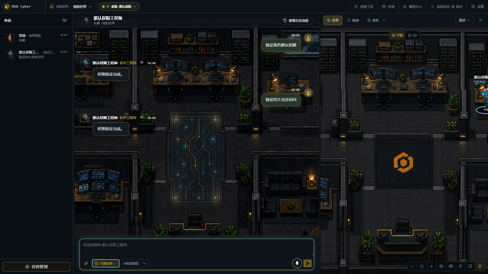
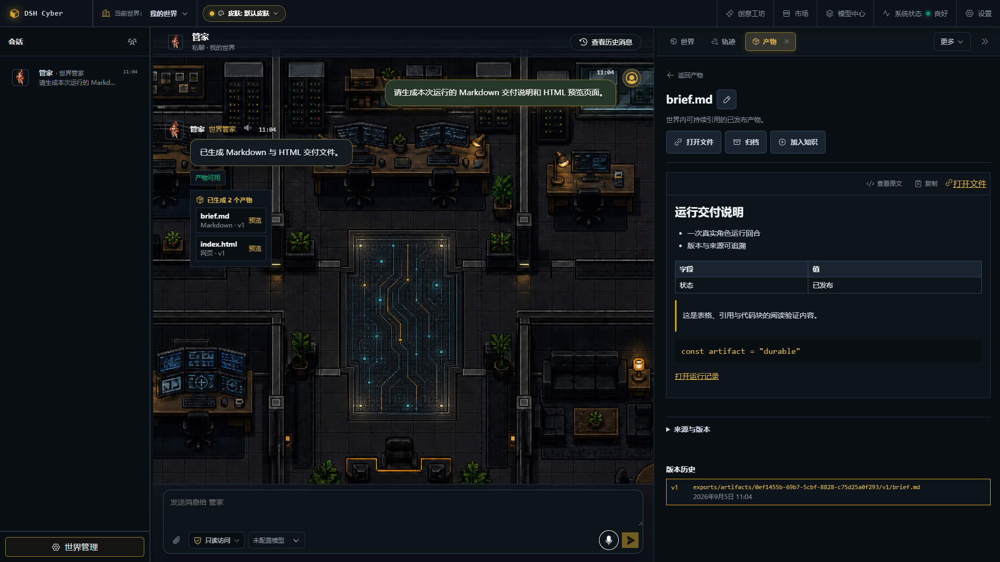
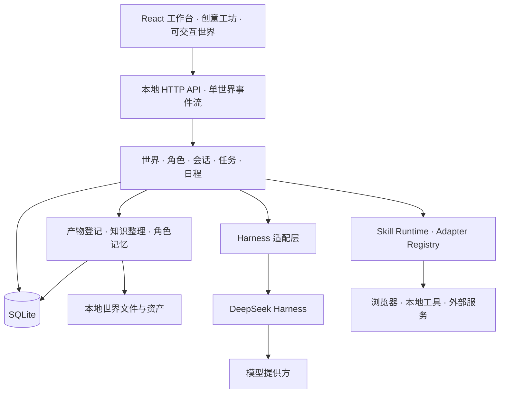

<div align="center">

# DSH Cyber

**本地优先的 AI 角色协作工作台**

让角色拥有持续的身份与记忆，在可交互世界中交流、执行任务，并留下可查看的工作成果。

[官网](https://www.sandaoliu.cn/) · [English](./README_EN.md) · [贡献指南](./CONTRIBUTING.md)

[](https://github.com/cyber-ai-agent/dsh-cyber/actions/workflows/ci.yml)
[](https://github.com/cyber-ai-agent/dsh-cyber/actions/workflows/full-e2e.yml)
[](./LICENSE)

</div>

DSH Cyber 基于 [DeepSeek Harness](https://github.com/deepseek-ai/deepseek-harness) 构建，把模型与工具执行能力组织成世界、角色、会话和工作成果。你可以建立个人助理空间、开发团队、内容工作室或叙事世界，为角色配置身份、模型和技能。

项目处于 **Pre-Alpha**，接口与功能仍在迭代。模型服务需要自行配置；功能效果取决于所选模型、工具授权与本地运行环境。

## 项目截图



*工作台示例：左侧会话、中间交流、右侧世界与结果入口。*



*示例文件通过实际登记与预览链路打开；截图使用隔离的演示数据。*

## 可以做什么

| 能力 | 用途 |
| --- | --- |
| 持续角色 | 为角色设置身份、职责、模型与技能，保留独立私聊、档案和经历。 |
| 多角色协作 | 在同一世界开展讨论和任务协作，查看每个角色的真实运行状态。 |
| 可交互世界 | 用场景与角色呈现工作上下文，切换世界时同步切换会话和资料。 |
| 世界产物 | 将真实文件登记为可引用的版本，阅读文档、图片、代码与隔离网页预览。 |
| 知识与记忆 | 导入资料供角色检索；按来源整理知识图谱，按角色保留会话记忆。 |
| 任务与日程 | 管理工作计划、分工、交付与验收，安排有运行记录的定时工作。 |
| 创意工坊与市场 | 创建世界、角色、皮肤和插件草稿，审查后通过统一扩展包机制安装。 |
| 模型中心 | 管理供应商连接和模型选择，支持兼容接口与本地加密凭据。 |

会话负责交流，轨迹负责解释执行过程。产物必须对应真实文件；模型的自然语言声明不会被当成工具成功或任务完成。

## 核心思想

### 角色是持续实体

角色不只是一次性的提示词。身份、私聊、模型策略、记忆、技能授权和工作经历都关联到稳定的角色标识。不同世界有独立的角色与数据边界。

### 本地数据归用户所有

SQLite 保存会话和业务事实，本地文件保存世界、资料、产物和扩展包。程序目录与数据目录分离；更新源码和依赖不会重新创建用户世界。备份覆盖数据库和用户资产，凭据与可重新安装的运行时缓存单独管理。

### 能力与授权分开

安装插件、角色请求技能、用户授予技能和批准一次具体操作是不同的事情。工具及外部动作通过受信任的适配器执行，记录来源、授权和结果。

| 对话权限 | 文件与命令范围 |
| --- | --- |
| 只读访问 | 读取与搜索；修改文件需单独批准。 |
| 当前世界 | 读写当前世界的项目目录；越界操作需单独批准。 |
| 完全访问 | 在当前系统账号权限内读写文件并执行命令，不再请求工具审批。启用前需要显式确认。 |

权限沿用 DSH 原生模式。当前世界模式遵循 DSH 对平台临时目录的例外；无人值守日程不允许使用完全访问权限。外部 Skill 动作仍由自己的授权与审批链管理。

### 可视化不代替执行事实

场景中的移动、状态和动画帮助理解工作，但不能作为完成证据。任务、运行、产物版本和验收分别记录，失败可以被定位，重试不能重复产生外部副作用。

## 技术架构



- **前端**：TypeScript、React、Vite；PixiJS 世界视图与按需加载的 3D 能力。
- **服务端**：Node.js 本地服务，领域编排、持久队列与完成后处理分离。
- **持久化**：SQLite、版本化迁移、本地资产与完整备份。
- **运行时**：DeepSeek Harness 通过 SDK 子进程接入，上层领域不依赖其私有实现。
- **验证**：Vitest 服务与合同测试、Playwright 浏览器流程、构建预算检查。

源码按职责组织：

| 目录 | 职责 |
| --- | --- |
| `packages/contracts` | 领域数据与接口合同 |
| `packages/orchestration` | 会话、角色运行与协作编排 |
| `packages/persistence` | SQLite 存储、队列与迁移 |
| `packages/harness-adapter`、`packages/harness-bundle` | DSH 兼容与 Worker 组合 |
| `packages/server`、`packages/cli` | 本地 API、服务与命令行 |
| `packages/web`、`packages/world-runtime` | 工作台与世界运行时 |
| `packages/package-runtime`、`packages/catalog`、`marketplace` | 扩展包与内置目录 |

当前锁定 DSH `0.1.2-rc.1`。上游尚无正式稳定版，升级通过兼容检查与真实运行测试后再纳入项目。

## 快速开始

准备 Node.js 22.19+（22 LTS）或 24+，以及项目指定的 pnpm 11。

```bash
git clone https://github.com/cyber-ai-agent/dsh-cyber.git
cd dsh-cyber
pnpm install --frozen-lockfile
pnpm build
pnpm dsh-cyber web
```

打开 [本地工作台](http://127.0.0.1:43123)，在“模型中心”配置服务地址、密钥与模型，再进入世界开始交流。

需要本地语音时，额外运行 `pnpm voice:install`。语音模型按需加载；对话模型使用你配置的服务。

常用命令：

```bash
pnpm dsh-cyber doctor
pnpm dsh-cyber web --no-open
pnpm typecheck
pnpm test
pnpm test:e2e
```

默认数据目录为 Windows 的 `%LOCALAPPDATA%\DSH Cyber`，macOS/Linux 的 `~/.dsh-cyber`。可使用 `--data-dir` 指定其他位置。

## 更新与备份

先备份，再更新程序：

```bash
pnpm dsh-cyber backup
git pull --ff-only
pnpm install --frozen-lockfile
pnpm build
pnpm dsh-cyber doctor
pnpm dsh-cyber web
```

更新前停止旧服务；使用自定义数据目录时，备份与重启继续指定同一个 `--data-dir`。这些操作更新程序，不清空世界、会话或资产。完整操作见[本地升级与恢复](./docs/operations/local-first-upgrades.md)。

## 贡献与许可

欢迎贡献功能、主题、扩展包、测试和文档。提交前请阅读[贡献指南](./CONTRIBUTING.md)与[架构规范](./docs/development/architecture-guidelines.md)。产品方向见 [Roadmap](./docs/roadmap.md)。

许可与第三方说明见 [LICENSE](./LICENSE)。感谢 [DeepSeek Harness](https://github.com/deepseek-ai/deepseek-harness) 提供底层运行框架。
