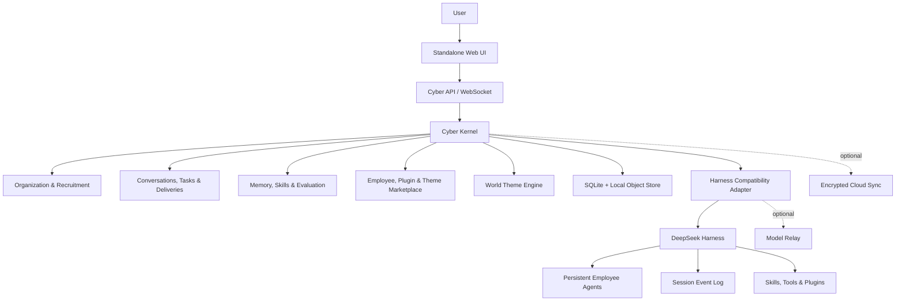

# DSH Cyber

DSH Cyber is a local-first, standalone multi-agent workspace built on top of [DeepSeek Harness](https://github.com/deepseek-ai/deepseek-harness). It turns persistent AI agents, tools, skills, sessions, and plugins into an interactive world that can be used without the original DSH web interface.

The default world is **Cyber Company**. Additional worlds can present the same agents and work as a tavern, creator studio, research lab, or another theme without resetting identity, memory, conversations, or tasks.

> Status: early development. The command-line package and Web UI are not published yet.

## Highlights

- **Standalone Web UI** — one focused interface for conversations, task context, traces, and deliveries.
- **Real multi-agent conversations** — every recruited employee is a persistent agent with its own identity, session, memory, permissions, and work history.
- **Direct and group chat** — message an employee directly with `@`, or bring multiple agents into the same work session.
- **Recruitable employees** — start with an empty workspace and add roles from an employee marketplace when needed.
- **Evidence-based growth** — skills improve through actual tool use, task outcomes, evaluation, and explicit approval.
- **Themeable worlds** — switch scenes, terminology, outfits, and status animations without changing underlying data.
- **Global plugin ecosystem** — install DSH capabilities once, then grant them to specific workspaces or employees.
- **Local-first persistence** — SQLite stores workspace data locally and keeps the core product available offline.
- **Optional cloud sync** — encrypted backup, version history, multi-device sync, and team workspaces can be added without taking ownership away from the local database.

## Product model

### Worlds

A world controls presentation: layout, terminology, scene assets, character appearance, and the mapping from real events to animation.

| World | Example vocabulary | Typical use |
| --- | --- | --- |
| Cyber Company | employees, departments, tasks, meetings | product and engineering work |
| Tavern | companions, quests, parties | playful multi-agent coordination |
| Creator Studio | editors, topics, drafts, publishing | content production |

Changing worlds does not recreate agents or move user data into a separate runtime.

### Employees

Marketplace entries are versioned employee blueprints. Recruiting a blueprint creates a private employee instance in the user's workspace. Each instance can have:

- a persistent Harness subagent/session identity;
- an independent persona and memory;
- scoped skills, tools, plugins, and model policy;
- task history, deliveries, evaluations, and revisions;
- theme-specific avatars and outfits.

The invisible Harness root agent is runtime infrastructure only. It does not impersonate employees in conversations.

### Skills and plugins

Packages can be installed globally while access remains scoped. Installation, enablement, employee authorization, and skill mastery are separate states.

Employees do not silently install plugins or rewrite their production persona. New capabilities go through inspection, permission review, isolated testing, evaluation, approval, and rollback-aware promotion.

## Local-first data

SQLite is the authoritative local database for workspace data, including:

- organizations and employee instances;
- conversation and task indexes;
- permissions and package grants;
- skill evidence and growth history;
- theme settings and synchronization cursors.

Large artifacts are stored separately and referenced by content hash. Harness remains the source of truth for model execution events and session trajectories.

The planned cloud synchronization service is optional. Offline use, local backup, export, restore, and continued access do not require a subscription. Cloud sync adds encrypted replication, version history, multi-device recovery, and team collaboration.

## Architecture



DSH Cyber uses a dedicated Harness profile and a bundle package with a valid `dsh.bundle` manifest. A compatibility adapter isolates the product from breaking changes in the Harness developer preview.

The UI is event-driven. Chat, status, task history, and world animation are projections of real Harness session events and DSH Cyber domain events; visual activity is not generated independently of the runtime.

## Planned command

```bash
npx @dsh-cyber/cli web

# After global installation
dsh-cyber web
```

The command will create or upgrade a dedicated profile, start the standalone server on a loopback address, and open the product Web UI. Remote access will require explicit authentication, origin policy, and TLS configuration.

## Package types

The ecosystem is designed around five package types:

| Package | Purpose |
| --- | --- |
| Runtime Plugin | models, tools, channels, storage, and other DSH capabilities |
| Skill Pack | reusable instructions, references, and workflows |
| Employee Blueprint | recruitable roles with capability requirements and evaluations |
| World Theme | layouts, terminology, scenes, and event-to-animation mappings |
| Asset Pack | avatars, outfits, sound, and other licensed media |

GitHub's [`dsh-plugin` topic](https://github.com/topics/dsh-plugin) is a discovery source, not a trust guarantee. Marketplace packages will be checked for manifest compatibility, origin, integrity, permissions, license, and runtime behavior before they are granted to a workspace.

## Security principles

- The local server listens on loopback by default.
- Secrets stay in a server-side secret store and are referenced rather than copied into events or browser state.
- Plugins and employees receive explicit, least-privilege capability grants.
- Untrusted executable packages require process, runtime, or container isolation; `node:vm` is not treated as a security boundary.
- Theme and asset packages do not gain runtime capabilities by changing presentation.
- Irreversible actions such as publishing, payments, external messaging, and destructive operations require approval or compensating controls.
- Marketplace installs, grants, model calls, and employee revisions remain auditable.

## DeepSeek Harness compatibility

The architecture follows the official Harness plugin, service, event, skill, subagent, and session-projection model:

- [DeepSeek Harness](https://www.deepseek.com/harness/)
- [Official repository](https://github.com/deepseek-ai/deepseek-harness)
- [Quick start](https://deepseek-harness.github.io/deepseek-harness/guide/quickstart)
- [Architecture](https://github.com/deepseek-ai/deepseek-harness/blob/master/docs/architecture.md)
- [Plugin development](https://github.com/deepseek-ai/deepseek-harness/blob/master/docs/user/develop/basic/index.md)
- [Skills](https://github.com/deepseek-ai/deepseek-harness/blob/master/docs/subsystems/skills.md)
- [Subagents](https://github.com/deepseek-ai/deepseek-harness/blob/master/docs/subsystems/subagent.md)
- [Session projections](https://github.com/deepseek-ai/deepseek-harness/blob/master/docs/subsystems/session-projection.md)
- [Cordis paper](https://github.com/cordiverse/paper)

Harness is currently a developer preview. Releases of DSH Cyber will publish an explicit compatibility matrix instead of assuming internal APIs are stable.

## Contributing

The implementation repository is being prepared. Contribution guidelines, package contracts, development commands, and compatibility tests will be added with the first runnable release.

Please use GitHub issues for product questions, compatibility reports, and package proposals once issue templates are available. Do not include model credentials, tokens, private session logs, or personal workspace data.

## License

DSH Cyber is source-available under the [PolyForm Noncommercial License 1.0.0](./LICENSE). Commercial use requires separate written permission from the copyright holder.

This is not an official DeepSeek project. Third-party components and references remain subject to their own licenses; see [THIRD_PARTY_NOTICES.md](./THIRD_PARTY_NOTICES.md).
