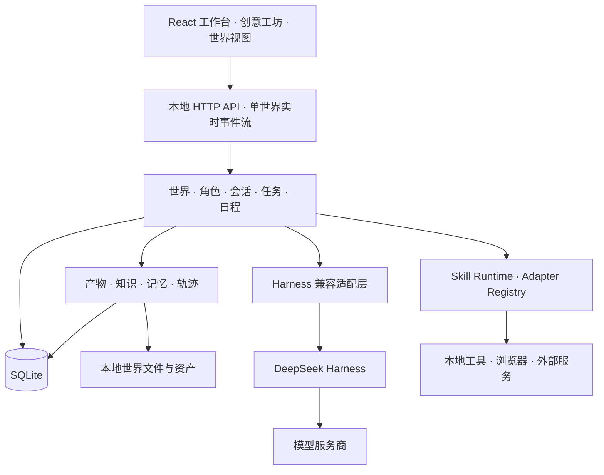

<div align="center">

# DSH Cyber

### 本地优先的 AI 角色、协作任务与可交互世界

让 AI 角色拥有持续身份、独立会话、真实技能和可追溯成果，在属于你的本地世界中长期工作与成长。

[官网](https://www.sandaoliu.cn/) · [English](./README_EN.md) · [产品路线](./docs/roadmap.md) · [贡献指南](./CONTRIBUTING.md)

[](https://github.com/cyber-ai-agent/dsh-cyber/actions/workflows/ci.yml)
[](https://github.com/cyber-ai-agent/dsh-cyber/actions/workflows/full-e2e.yml)
[](./LICENSE)

**Pre-Alpha** · 自备模型服务 · Windows / macOS / Linux

</div>


<p align="center"><em>深海女仆工坊：会话、角色、世界与运行权限在同一个工作台中协同。</em></p>

DSH Cyber 基于 [DeepSeek Harness](https://github.com/deepseek-ai/deepseek-harness) 构建。它把模型与工具执行能力组织为长期存在的世界、角色、会话、任务和成果，而不是把多个角色压缩成一次性的提示词。

你可以用它建立个人助理空间、开发团队、内容工作室、叙事酒馆或其他 AI 世界。每个世界拥有自己的角色、会话、文件、知识、任务和运行状态；切换世界时，这些上下文会一起切换。

## 当前能力

| 能力 | 当前实现 |
| --- | --- |
| 持续角色 | 每个角色拥有稳定身份、职责、档案、模型策略、Skill 授权、独立私聊和成长记录。 |
| 会话与协作 | 支持私聊、群聊、角色讨论和任务协作；会话正文、运行状态和恢复边界按世界隔离。 |
| 任务与日程 | 任务记录分工、进度、交付和验收；计划任务持久化运行结果，并防止同一时间片重复执行。 |
| 世界与具身 | PixiJS 世界视图展示角色、设施和工作状态；主题、角色和 Skill 彼此解耦。 |
| 轨迹与证据 | 聊天只显示最终交流结果；运行摘要、工具状态、任务来源和可公开证据进入世界轨迹。 |
| 世界产物 | 将真实文件发布为不可变版本，支持 Markdown、代码、JSON、PDF、图片和隔离网页预览。 |
| 知识与记忆 | 导入文件、文件夹、ZIP、粘贴内容和公开网页；按来源检索资料并形成带证据的知识图谱。 |
| 创意工坊 | 通过分步流程创建世界、角色、皮肤和插件草稿，经预览与包校验后安装。 |
| 统一市场 | 按“世界 → 角色 → 插件”浏览和安装扩展，并继续完成创建世界、招募角色或启用插件。 |
| 模型中心 | 管理模型服务商、同步模型目录、按工作区/世界/角色分配模型，并查看按服务商归属的交互与 Token 统计。 |
| 本地语音 | 可选安装本地 TTS 与 STT；浏览器通过本机服务使用流式音频、语音识别和打断。 |

任务进度会随来源会话的状态变化实时刷新。模型运行发生重连、超时或取消时，工作台会按请求归属核对状态，避免旧响应覆盖当前世界或会话。

## 三个核心原则

### 角色是持续实体

角色不是一段临时 Prompt。一个稳定的角色标识同时连接身份、私聊、世界中的具身形象、记忆、Skill 授权、工作记录和成长证据。角色可以在协作中独立运行，也能保留自己的模型与权限边界。

### 本地数据归用户所有

SQLite 保存会话与领域事实，本地目录保存世界文件、知识资料、产物和扩展包。程序源码与用户数据使用不同目录；更新源码、依赖或 Harness 不会重新初始化已有世界。

默认数据目录：

- Windows：`%LOCALAPPDATA%\DSH Cyber`
- macOS / Linux：`~/.dsh-cyber`

完整备份覆盖 SQLite、`worlds/`、`assets/`、`packages/`、`workshop/`、`skills/` 和 `integrations/`。凭据、运行时二进制与可重建缓存不进入普通备份。

### 可视化不代替执行事实

世界中的移动、灯光和状态帮助理解工作，但不会被当成任务完成证据。任务、运行、产物版本和验收分别记录；只有 Adapter 返回的真实工具结果才能进入 Agent 上下文并支持“已完成”的结论。

```text
Chat   = 用户消息 + 最终回复 + 附件 + 明确的产品通知
Trace  = 运行状态 + 工具摘要 + 安全证据 + 任务来源
```

轨迹只展示脱敏、限长后的安全摘要与工具证据，不持久化密钥、Authorization、Cookie、密码、Token、完整 Prompt 或原始工具 payload。

## 深海主题世界

世界主题为聊天区域、世界视图和角色形象提供统一的视觉语境。当前内置深海系列包括深海女仆工坊、白鲸圣女和漆黑虎鲸。

<table>
<tr>
<td width="50%">

<br/><b>白鲸圣女</b><br/>明亮的海底圣殿与白鲸场景。
</td>
<td width="50%">

<br/><b>漆黑虎鲸</b><br/>深海舰桥、虎鲸群与冷色霓虹界面。
</td>
</tr>
</table>

## 工作台信息架构

```text
顶部：创意工坊 · 市场 · 模型中心 · 系统状态 · 设置
左侧：当前世界的会话
中间：聊天与最终结果
右侧：世界 · 轨迹 · 更多
更多：角色 · 任务 · 知识 · 产物 · 日程等按需页签
```

- 左侧只显示会话；角色实例的浏览、设置、授权和成长记录集中在“角色”档案。
- 市场负责安装模板，角色档案负责把模板招募为世界中的角色。
- “更多”中的低频页面会提升为可关闭页签；关闭页签不会删除内容或状态。
- 世界视图负责角色互动和状态呈现；新增、归档与权限管理由角色档案完成。

## 模型、权限与真实动作

模型中心从仓库维护的 [`catalog/model-providers.json`](./catalog/model-providers.json) 加载可用入口，支持内置服务商、本机或局域网服务以及自定义 OpenAI 兼容接口。模型默认按以下优先级继承，会话也可以显式选择其他模型：

```text
角色模型 > 世界模型 > 工作区默认模型 > 默认模型档案
```

API 密钥通过本机随机密钥加密后单独保存，不写入 SQLite、接口响应、日志或 Git。模型统计按实际交互日志汇总，只累计服务商已上报的用量；服务商筛选只列出当前已配置项，无法归属的历史记录仍计入“全部”。

| 对话权限 | 文件与命令范围 |
| --- | --- |
| 只读 | 读取和搜索；不允许修改文件。 |
| 当前世界 | 读写当前世界的项目目录；越界操作仍需单独授权。 |
| 完全访问 | 使用当前系统账号可访问的路径与命令；保存前必须显式确认风险。 |

安装插件、角色请求 Skill、用户授予 Skill、批准一次具体动作和动作真正执行是五个不同阶段。无人值守日程不允许使用完全访问；外部 Skill 动作继续经过各自的授权、审批与审计链。

## 技术架构



- **前端**：TypeScript、React、Vite、PixiJS，以及按需加载的 3D 能力。
- **服务端**：Node.js 本地服务，领域编排、持久队列和完成后处理分离。
- **持久化**：SQLite、版本化迁移、本地资产与完整备份。
- **运行时**：DeepSeek Harness 通过兼容适配层接入，上层领域不依赖 Harness 私有 API。
- **验证**：Vitest 单元与合同测试、Playwright 浏览器流程、构建预算检查。

主要源码目录：

| 目录 | 职责 |
| --- | --- |
| `packages/contracts` | 领域数据与接口合同 |
| `packages/orchestration` | 会话、角色运行与协作编排 |
| `packages/persistence` | SQLite 存储、队列与迁移 |
| `packages/harness-adapter`、`packages/harness-bundle` | DSH 兼容与 Worker 组合 |
| `packages/server`、`packages/cli` | 本地 API、服务与命令行 |
| `packages/web`、`packages/world-runtime` | 工作台与世界运行时 |
| `packages/package-runtime`、`packages/catalog`、`marketplace` | 扩展包、服务商目录与内置市场 |

当前锁定 DeepSeek Harness `0.1.2-rc.1`。上游尚无正式稳定版，升级候选需要经过合同测试、真实启动与回滚验证。

## 快速开始

准备 Node.js `22.19+`（22 LTS）或 `24+`，以及 pnpm `11.7.0`。

```bash
git clone https://github.com/cyber-ai-agent/dsh-cyber.git
cd dsh-cyber
pnpm install --frozen-lockfile
pnpm build
pnpm dsh-cyber web
```

打开 [http://127.0.0.1:43123](http://127.0.0.1:43123)，在“模型中心”添加服务商、同步或填写模型 ID，再进入世界开始交流。

需要本地语音时额外执行：

```bash
pnpm voice:install
```

常用命令：

```bash
pnpm dsh-cyber doctor
pnpm dsh-cyber web --no-open
pnpm typecheck
pnpm test
pnpm test:e2e
```

## 更新与备份

先备份本地状态，再更新程序：

```bash
pnpm dsh-cyber backup
git pull --ff-only
pnpm install --frozen-lockfile
pnpm build
pnpm dsh-cyber doctor
pnpm dsh-cyber web
```

更新前停止旧服务。使用自定义数据目录时，备份与重启继续指定同一个 `--data-dir`。这些命令只更新程序，不会清空世界、会话或资产。完整流程见[本地升级与恢复](./docs/operations/local-first-upgrades.md)。

## 项目状态

项目目前处于 **Pre-Alpha**，接口、持久化结构和扩展合同仍可能调整。模型服务需要自行配置，实际效果取决于模型能力、授权范围与本地运行环境。

产品规划见 [Roadmap](./docs/roadmap.md)，架构细节见[技术报告](./docs/technical-report.md)和[开发规范](./docs/development/architecture-guidelines.md)。

## 贡献

欢迎贡献功能、世界主题、角色模板、扩展包、测试和文档。开始前请阅读[贡献指南](./CONTRIBUTING.md)与[架构规范](./docs/development/architecture-guidelines.md)。涉及领域边界、持久化或权限模型的重大变更，请先讨论设计。

## 许可：仅限非商业用途

DSH Cyber 使用 [PolyForm Noncommercial License 1.0.0](./LICENSE)。该许可允许个人研究、实验、学习、私人娱乐、业余项目，以及许可条款列明的非商业组织用途。

**本仓库未授予商业用途许可。** 任何预期商业应用、商业部署、收费服务，或以商业目的进行的销售、转售及其他使用，都需要事先取得权利人的另行授权。分发本软件或修改版本时，必须同时提供完整许可条款或其正式链接，并保留许可文件中的 Required Notice。

完整、具有约束力的条款以仓库中的 [LICENSE](./LICENSE) 为准。第三方组件继续适用各自的许可条款。

---

<div align="center">

**构建一个持续生长的 AI 世界，并把数据留在自己手中。**

</div>
