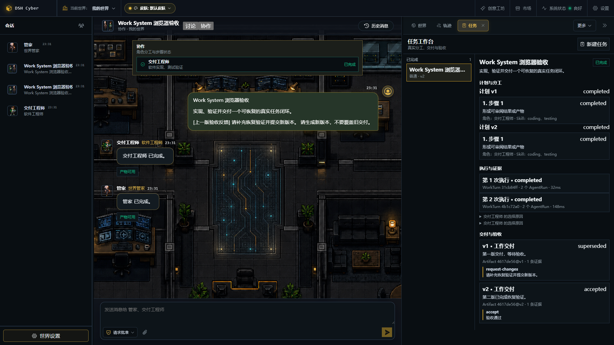
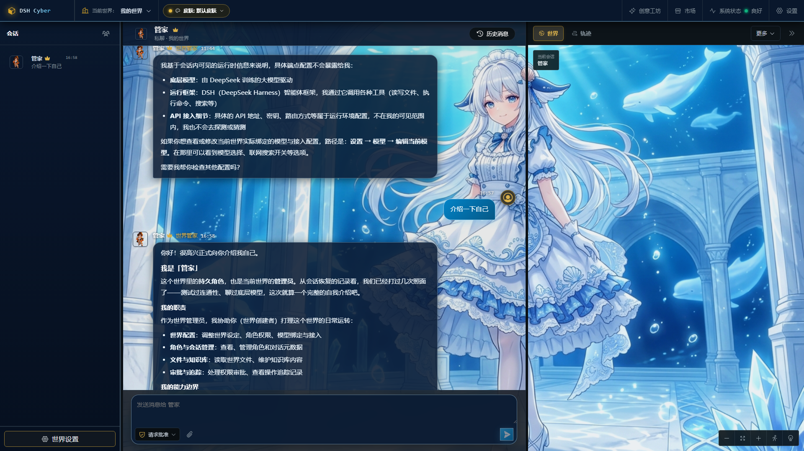
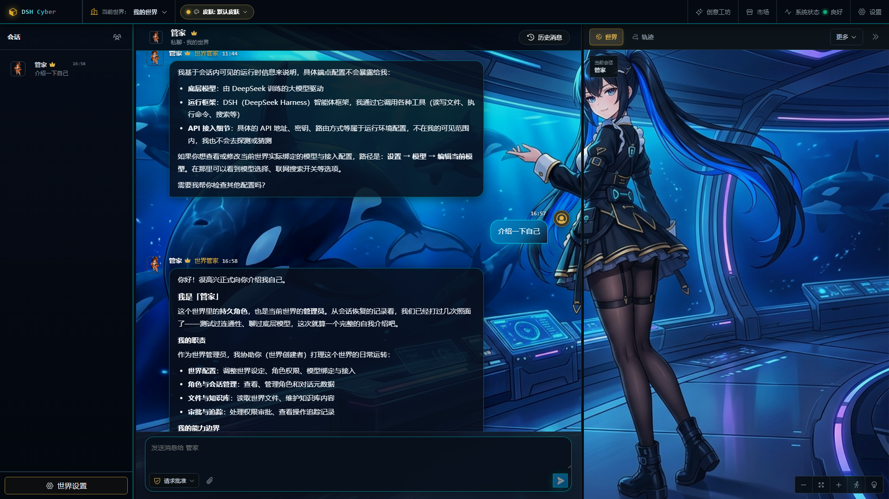
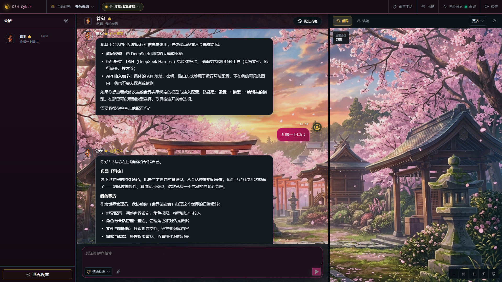
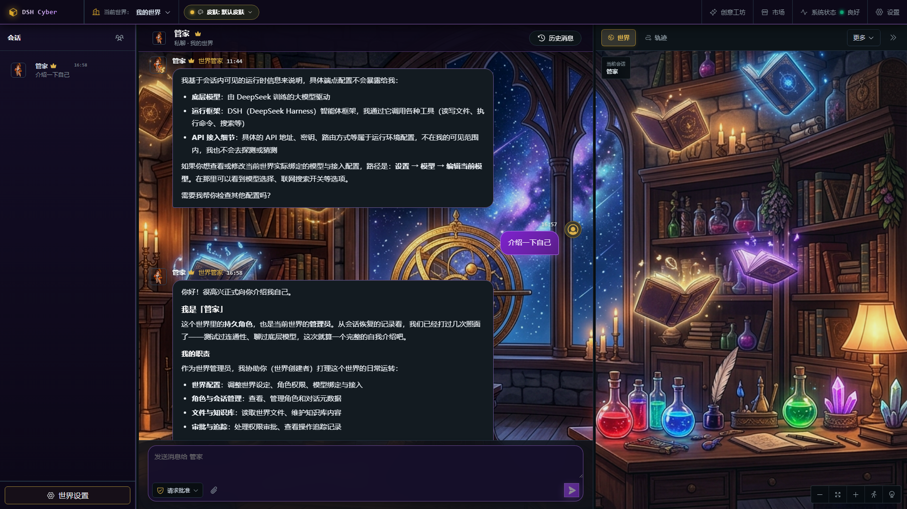
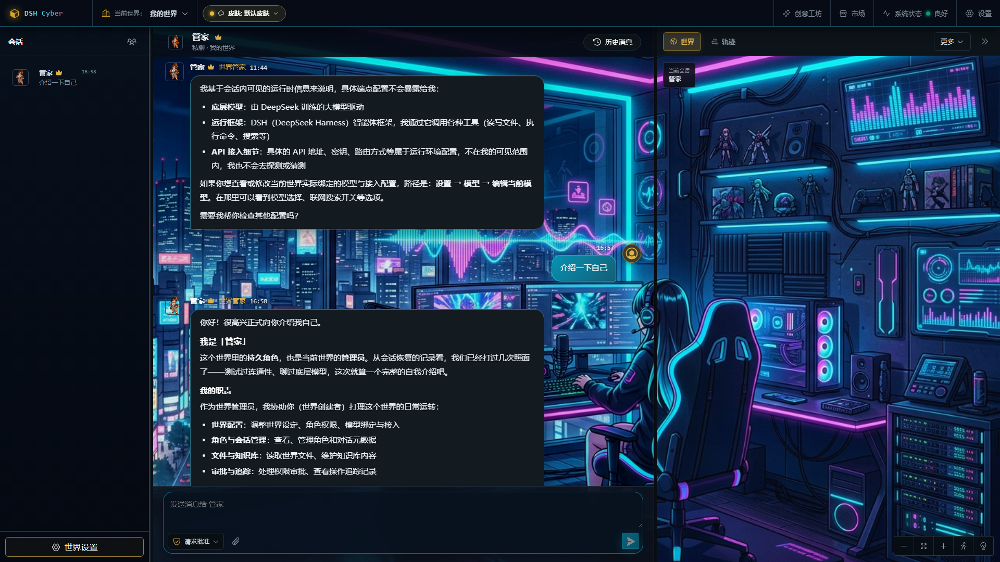
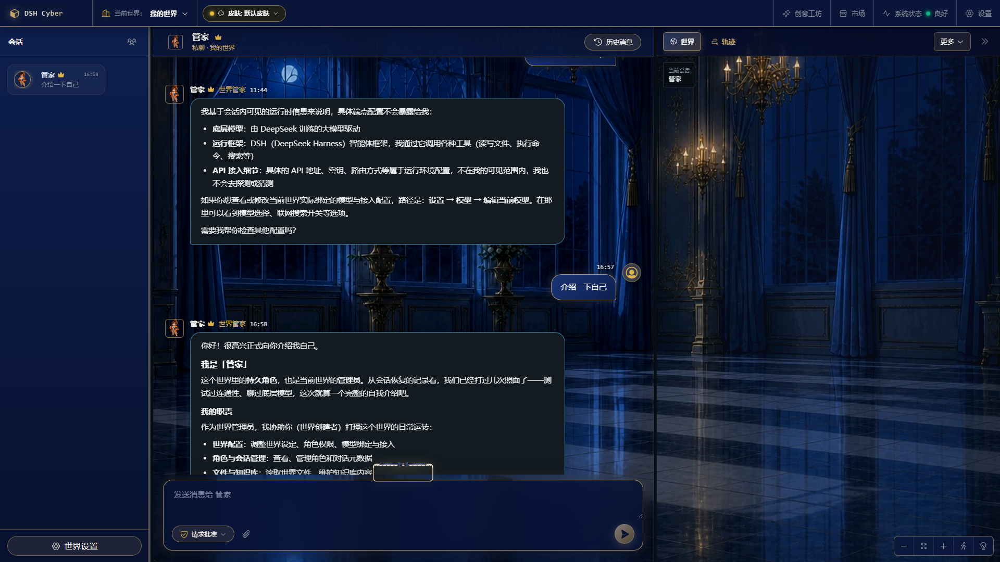
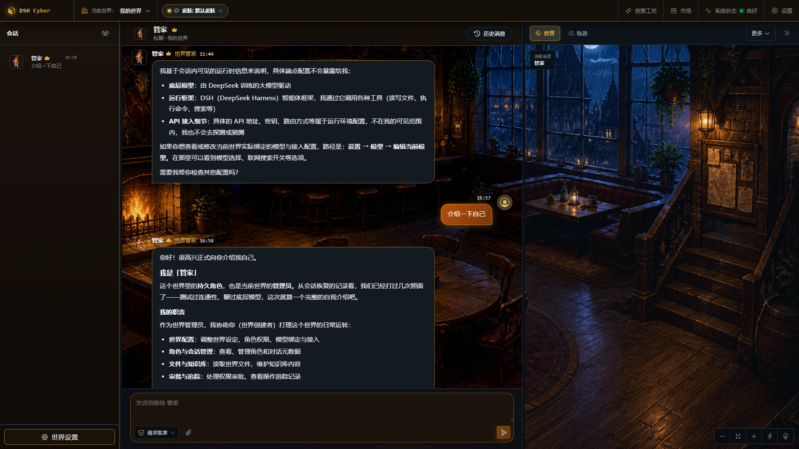
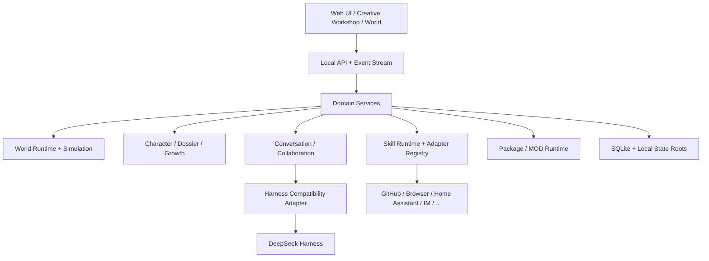

<div align="center">

# DSH Cyber

### 一个本地优先、可接任务、可协作、可交付、可验收和可恢复的数字员工工作系统

**Build a living AI world — characters with identity, memory, bodies, skills, relationships and real actions.**

[官网](https://www.sandaoliu.cn/) · [English](./README_EN.md) · [技术报告](./docs/technical-report.md) · [Roadmap](./docs/roadmap.md) · [贡献指南](./CONTRIBUTING.md)

[](https://github.com/cyber-ai-agent/dsh-cyber/actions/workflows/ci.yml)
[](https://github.com/cyber-ai-agent/dsh-cyber/actions/workflows/full-e2e.yml)
[](https://github.com/cyber-ai-agent/dsh-cyber/stargazers)
[](./LICENSE)

> **Pre-Alpha** — 项目仍在快速重构。当前重点是把 Creative Platform V1 的架构边界做对，再进入稳定兼容阶段。

</div>

---

## 为什么做 DSH Cyber？

我们希望 AI 角色不再只是一个 Prompt。

```text
Character
├─ Identity
├─ Persona
├─ Agent Session
├─ Model Policy
├─ Embodiment
├─ Memory
├─ Relationships
├─ Skill Grants
├─ Work History
├─ Evidence
└─ Growth
```

一个角色应该能长期存在，有自己的会话、档案、身体、关系、技能和成长轨迹；进入不同世界时保持身份一致；需要调用真实世界能力时，通过受控 Skill Adapter 完成真实动作，并把结果写回可审计状态。

DSH Cyber 正在把这件事做成一个**可视化、可扩展的本地数字员工工作系统**：你可以提交任务、让多个长期角色按 Skill 和负载协作、审阅不可变交付版本，并通过受控 Skills 联动 GitHub、浏览器、Home Assistant、IM 机器人和其他真实系统。世界和主题提供沉浸式工作上下文，但不会伪造任务完成或外部动作成功。

## 真实任务工作流



```text
用户目标 → Task → Plan Revision → Assignment → WorkTurn → AgentRun
        → ArtifactVersion → DeliverableVersion → Review → Evidence
```

- 同一个数字员工可以在两个会话并发工作，Presence 从真实 AgentRun/审批事实派生。
- Artifact 后处理通过 Completion Outbox 重试；整理失败不会反向把模型主回答判为失败。
- 用户接受、要求修改或拒绝交付；要求修改会保留旧版本并生成新的 Plan/Run/Deliverable。
- Queue 使用 SQLite claim/lease，重启后按幂等与外部副作用边界恢复。

---

## 当前已经实现

### ✅ Work System V1

- 世界级 Task Inbox / Board、任务详情、计划步骤、分工原因、执行与证据。
- 复用现有 Group Task Router、WorkTurn、AgentRun、Approval、Trace 和 Artifact，不平行复制执行系统。
- 不可变 Deliverable 版本与追加式 Review；要求修改后把反馈注入新一轮执行。
- 接受的交付产生受信 Growth Evidence；模型自述不会直接提升熟练度。
- Task、Queue、Completion Job、Artifact、Deliverable 和 Review 随 SQLite/`worlds/` 进入本地备份边界。

### 🧠 持久角色与会话连续性

- 每个角色拥有独立 Agent session、模型策略、档案和长期身份。
- 一个角色对应一个稳定 canonical 私聊，会话可以置顶/隐藏，管家默认置顶。
- 角色可以参与真实多角色协作，不由一个“总控 Prompt”假装所有人发言。
- 角色之间的共享经历和关系证据可以持久化。

#### 当前会话连续性

- 同一个会话的最近聊天历史由本地 SQLite 恢复，可以跨应用重启、Harness Runtime 重建和权限模式切换。私聊、群聊和不同世界之间不共享历史。
- 每次用户交互和每次实际角色运行都有持久状态，可查看私聊、群聊和角色协作的运行顺序与结果。服务重启会安全终止未完成记录，不自动重放可能产生副作用的调用。
- SQLite 是会话历史与执行状态的权威；DSH Session 和实时事件是可重建的运行时状态。
- 当前世界可以从知识库检索外部原始资料并用于回答；对话自动提炼、知识图谱、情景记忆、向量索引和跨会话语义记忆仍在后续阶段。
- 世界轨迹按角色、日期、关键词和执行状态检索中文执行记录，展示安全的判断摘要、工具调度、耗时与模型返回的真实 Token 用量。完整 Prompt、原始工具输入和原始工具结果不会进入轨迹；模型返回的已完成 reasoning 块会经密钥脱敏和长度截断后展示，不做摘要或翻译，流式 reasoning 增量则被直接丢弃。

### 🌍 Embodied Worlds

- World Runtime + World Simulation 分层。
- PixiJS 可视化世界、状态投影、角色移动、会议、灯光与具身动作。
- deterministic role-aware ambient life，避免无意义随机走动。
- 自定义角色通过 `EmbodimentProfile` 使用语义标签绑定区域、设施、行为和动画 Rig。
- 世界、角色、Skill 三者显式解耦。

### ✨ Creative Workshop

- 顶栏独立「创意工坊」入口。
- 新建世界采用四步向导，依次配置世界、角色、权限与 Skills、创建前确认；页面不会一次铺开全部高级字段。
- 本地项目库：用户创建的世界项目保存在 `stateRoot/workshop`。
- 世界观、场景、角色 Persona、Embodiment 与 Skill 请求分别建模。
- Workshop 会把角色编译成标准扩展包，再经过 `PackageManager` preview / install。
- 支持基于已有项目创建安全副本，避免直接覆盖运行中的不可变历史。

### 🧩 Market / MOD Foundation

统一市场包含：

- World Themes
- Plugins
- Character Blueprints

扩展包拥有 manifest、内容哈希、权限声明、来源和安装事务。当前第三方运行入口仍以声明式能力为主，不默认执行任意 JS / shell。

### 🔌 Trusted Skill Runtime

Skill 当前采用：

```text
Available
≠ Requested
≠ Granted
≠ Approved Action
≠ Executed Action
```

已完成：

- `CharacterSkillRuntime`
- `CharacterSkillAdapterRegistry`
- 结构化 Skill Action
- risk / authorization / adapterId / status
- durable scheduling
- Home Assistant Adapter V1
- 内置研究、开发、内容、项目管理和本地文件等 Skill Recipes，可按角色职责提供默认能力建议。
- Integration Registry 与 Firecrawl Adapter V1。
- MCP Streamable HTTP Adapter V1，工具发现和调用继续经过角色授权、逐动作审批与本地 Action Ledger。

### 🔐 应用访问与角色对话权限

- 可设置全局应用锁；锁定后整个工作台被锁屏界面遮住，服务端同时拒绝世界、会话、消息和设置请求。
- 密码使用本机派生哈希保存，不写入 SQLite、日志或前端响应；每次服务启动后需要重新解锁。
- 产品不再设置“世界管理员”角色、徽标或管理员权限编辑器。世界设置由本机用户直接管理；角色运行权限统一为输入区同款三档：**请求批准、帮我批准、完全访问**。
- 新增角色时必须选择默认对话权限，角色设置中可以随时修改。私聊默认使用该角色的档位；多人会话采用参与角色中最保守的档位，单条消息仍可临时降低或调整。
- `read-only` 允许读取当前世界目录；`workspace-write` 允许读写当前世界目录；`danger-full-access` 可访问当前系统账号可访问的路径。
- 完全访问必须由用户首次显式确认。确认后的 grant 绑定具体世界、会话和角色，并持久化到本地 SQLite；刷新、切换世界/会话和服务重启后仍有效。把角色改回较低权限会撤销相关 grant。
- 角色自己的自然语言请求、Skill 或插件不能签发完全访问。外部副作用仍须经过结构化 Skill Action 和 Approval Gate。
- 待处理决策由 `world-decision` 事件驱动刷新；权限卡展示具体动作、目标和脱敏参数，而不是内部权限键名。
- 同一世界的设置写入串行并使用 revision 冲突保护；跨 SQLite 与文件系统的多动作不会伪装成全局事务。
- AI 模型连接先填写服务地址和密钥，再拉取、搜索并选择模型 ID；模型密钥只在当前设备加密保存。
- 设置页采用单列内容流，维护入口只保留真实的检查和安装更新功能。

外部动作只有 Adapter 返回真实执行结果后，Agent 才能告诉用户“已经完成”。

### 📦 世界产物

- 角色运行或用户可以把当前世界工作目录中的成果明确发布为世界产物；SQLite 保存稳定身份、来源、版本和会话关联，发布文件保存为世界内的不可变版本。
- 最终回复可附带产物卡。点击后使用对应阅读器打开：Markdown 文档排版、代码与行号、JSON 结构、PDF、图片、隔离网页预览或项目文件树。
- 产物与世界严格隔离，随 `worlds/` 和 SQLite 一起进入本地备份；刷新或重启不会丢失。工作目录中的临时文件不会被扫描或自动发布。
- 产物不会自动进入知识库，只有用户明确加入时才建立带来源的知识文档。

### 📚 世界知识库

- 每个世界拥有独立的原始资料库，支持 Markdown、TXT、JSON、PDF、文件夹、ZIP 知识包、粘贴内容和公开网页。
- 原始文件保存在 `worlds/<worldId>/knowledge/library`，SQLite 保存集合、文档元数据和可重建的文本分块。
- 搜索优先使用 SQLite FTS5；运行环境不支持时使用世界范围内的可移植 SQL 检索，不依赖向量数据库或额外模型。
- 角色回答问题时最多增加一次本地知识检索。外部资料始终是不可信数据，不能直接修改权限、批准操作或触发文件与 Skill 副作用。
- 知识源文件和 SQLite 一起进入本地备份，`doctor` 会报告集合、文档、分块与缺失源文件数量。

### 🕸️ 世界知识图谱

- 对话中的可见消息、知识库资料、世界产物和用户明确确认的信息可以在后台整理为实体、主张和关系；每条有效知识都保留可返回原消息、资料分块或产物版本的证据。
- 自动整理按世界独立运行，任务、会话游标、设置、冲突状态和用户归档记录都保存在 SQLite。服务重启不会重放已经完成的批次。
- “知识”页使用 Canvas 显示真实节点与连线，支持搜索、缩放、平移、聚焦、类型与来源筛选，并能查看主张、关系和证据详情。
- 运行时检索组合长期主张、知识库片段和一层图谱邻居。知识只作为回答上下文，不能修改权限、批准操作、写入文件或触发外部副作用。

### 💾 Local-first & Safe Upgrades

本地 `stateRoot` 当前是权威数据源。

完整 `.dshbackup` 已覆盖：

```text
SQLite
worlds/
assets/
packages/
workshop/
skills/
integrations/
```

世界目录中的 `knowledge/library` 与 `exports/artifacts` 属于用户长期资产，并随 `worlds/` 一起备份。

凭据、运行时二进制和可重建缓存不进入普通备份。

应用源码、Harness 与用户数据拥有不同生命周期；正常升级不会通过删除本地世界来“解决问题”。

---

## 界面与世界示例

DSH Cyber 采用**空间延伸设计哲学**：左侧沉浸聊天视窗作为场景透视底衬，右侧 2.5D 可交互世界画布自然接续天顶、地砖与光影，向右延伸展开为中央大厅与设施互动区，浑然一体。

### 🎨 多套高颜值沉浸二次元主题

<table>
<tr>
<td width="50%">

<br/><b>🤍 白鲸圣女 · 纯白极光</b><br/>圣洁极地 · 纯白丝袜与白金荷叶长裙 · 水下大理石圣殿与白鲸游弋
</td>
<td width="50%">

<br/><b>🖤 漆黑虎鲸 · 深渊机能</b><br/>深潜魅影 · 诱人黑丝与机能吊带袜 · 深渊未来舰桥与虎鲸群水幕
</td>
</tr>
<tr>
<td width="50%">

<br/><b>🌸 千樱神殿 · 樱落古院</b><br/>和风古雅 · 樱吹雪与绯粉霞光 · 朱红鸟居与祈愿神苑
</td>
<td width="50%">

<br/><b>🔮 星月魔女 · 秘术工坊</b><br/>奇幻秘术 · 幽夜星金 · 星象浑天仪与魔导炼金密室
</td>
</tr>
<tr>
<td width="50%">

<br/><b>⚡ 霓虹电波 · 虚拟演播室</b><br/>机能未来 · 赛博姬电波 · 全息频谱律动与电竞全景视窗
</td>
<td width="50%">

<br/><b>🏰 深海女仆工坊</b><br/>欧式宫殿 · 蓝金微晶 · 月光大厅与连贯深海殿堂
</td>
</tr>
<tr>
<td colspan="2" width="100%">

<br/><b>🍺 月影酒馆 · 雨夜古典奇幻沙龙</b><br/>暖灰琥珀 · 木质壁炉暖色调 · 适合叙事角色与同桌研讨会话
</td>
</tr>
</table>

当前信息架构已经收敛为：

```text
Topbar
├─ 创意工坊
├─ 市场
├─ 运行时健康
└─ 设置

Left
└─ 会话（类似微信会话列表）

Center
└─ 对话 / 工作台

Right
├─ 世界
├─ 角色
├─ 知识
├─ 产物
├─ 轨迹
└─ 日程
```

市场负责安装模板和扩展；档案负责实例化、配置、授权和查看具体角色。

---

## 架构



核心不变量：

```text
World != Character != Skill != Harness
```

一个稳定 `characterId` 连接：

```text
Agent identity
= canonical direct conversation contact
= world body
= dossier
= memory owner
= growth owner
= skill grant owner
```

详细设计见：

- [技术报告](./docs/technical-report.md)
- [Creative World Platform V1](./docs/architecture/creative-world-platform-v1.md)
- [世界产物中心 V1](./docs/architecture/world-artifact-center-v1.md)
- [世界知识库 V1](./docs/architecture/world-knowledge-library-v1.md)
- [世界知识图谱 V1](./docs/architecture/world-knowledge-graph-v1.md)
- [Architecture & Development Guidelines](./docs/development/architecture-guidelines.md)
- [CI Strategy](./docs/development/ci-strategy.md)

---

## 从 DeepSeek Harness 与 OpenAI Codex 吸收什么？

DSH Cyber 不把两个项目的内部实现直接复制进领域层，而是吸收它们值得长期保留的工程思想。

### DeepSeek Harness

参考 [`deepseek-ai/deepseek-harness`](https://github.com/deepseek-ai/deepseek-harness)：

- Registry / factory / scoped setup 分离；
- 能力通过稳定 Context/Provider 边界组合；
- setup 完成后再 publication；
- 生命周期和 ownership 显式；
- 不为了新增能力不断修改 Agent loop。

### OpenAI Codex

参考 [`openai/codex`](https://github.com/openai/codex)：

- sandbox-first；
- 最小权限；
- 对命令、网络、文件、工具调用等具体 Action 做审批；
- 一次授权、会话授权、策略修改拥有不同语义；
- 将风险和用户授权程度绑定到实际动作，而不是绑定整个插件。

DSH Cyber 再在上层加入：**世界、具身角色、长期记忆、关系、成长、本地所有权、MOD 和真实 Skill Action**。

---

## 快速开始

### 环境

- Node.js `22.19+` 或 `24+`
- pnpm `11.7+`

### 安装

```bash
git clone https://github.com/cyber-ai-agent/dsh-cyber.git
cd dsh-cyber
pnpm install
pnpm build
pnpm dsh-cyber web
```

默认监听：

```text
127.0.0.1:43123
```

常用命令：

```bash
pnpm dsh-cyber doctor
pnpm dsh-cyber backup --output ./backup.dshbackup
pnpm dsh-cyber web --no-open
pnpm typecheck
pnpm test
pnpm test:e2e
```

---

## 更新到最新版本，同时保留本地世界

推荐流程：

```bash
# 1. 先备份本地状态
pnpm dsh-cyber backup

# 2. 更新程序代码
git fetch origin
git switch main
git pull --ff-only origin main

# 3. 更新依赖并构建
pnpm install --frozen-lockfile
pnpm build

# 4. 检查本地状态
pnpm dsh-cyber doctor

# 5. 启动
pnpm dsh-cyber web
```

如果你使用自定义 `--data-dir`，升级前后继续使用**同一个目录**。

完整说明：[Local-first Upgrades](./docs/operations/local-first-upgrades.md)

### 当前开发期的兼容边界

目前仍处于 Pre-Alpha，尚未形成真实外部安装用户规模。Creative Platform V1 定型前，如果实验性旧结构严重阻碍正确架构，我们会优先做一次干净重构，而不是永久背负大量只服务于开发快照的兼容补丁。

**从正式声明本地数据兼容基线的版本开始**，所有持久化变更都必须使用 versioned migration + backup / restore 验证，正常升级不得清空用户数据。

---

## 模型与 Harness

模型配置支持多种供应商与 OpenAI-compatible endpoints，并允许：

```text
Employee model
  > World model
    > Workspace default
      > Default model profile
```

Harness 被限制在兼容适配层，不允许世界、角色、Skill 领域代码依赖 Harness 私有 API。

设置中的“应用更新”会检查 `main` 稳定通道，只接受干净工作树上的快进更新。安装前会在隔离工作树完成依赖安装和构建，并创建完整本地备份；更新完成后由用户重启应用。

底层 Harness 更新仍使用独立的候选版本检查、contract test、canary、人工激活、完整本地备份和 rollback 流程。

---

## 开发状态 / TODO

完整列表见 [Roadmap](./docs/roadmap.md)。当前重点：

- [ ] Creative Platform V1 稳定化
- [ ] Workshop 项目版本与编辑生命周期
- [ ] Character Identity / Persona / Embodiment 完全以用户当前设定为准
- [x] 有证据的长期知识图谱与对话整理
- [x] Task / Plan / Assignment / Run / Deliverable / Review 工作系统 V1
- [ ] GitHub Skill Adapter
- [ ] Browser Skill Adapter
- [ ] 飞书 / QQ / 微信 Channel Adapter
- [ ] Autonomous Collaboration Policy
- [ ] MOD 远程索引、签名、依赖与更新
- [ ] 自定义角色 Body / Rig / 动画资产
- [ ] 未来 3D 世界能力
- [ ] 可选加密云同步（本地仍为权威）

---

## 开发规范

我们希望这个项目越做越大，但不要越做越难改。

几个硬规则：

1. **不要通过角色名字写业务逻辑。**
2. **不要在核心 Runtime 里堆供应商 `if/else`。**
3. **requested capability 与 granted capability 必须分离。**
4. **外部真实动作必须结构化、可审批、可审计。**
5. **复杂 UI 继续拆组件，不把状态全部塞回 `App.tsx`。**
6. **新增持久化目录必须同步进入备份策略。**
7. **兼容基线之后，schema 变化必须有 migration。**
8. **测试产品契约，减少对按钮位置和 DOM 排列的耦合。**

详细规范：

- [`AGENTS.md`](./AGENTS.md)
- [`docs/development/architecture-guidelines.md`](./docs/development/architecture-guidelines.md)
- [`docs/development/ci-strategy.md`](./docs/development/ci-strategy.md)
- [`CONTRIBUTING.md`](./CONTRIBUTING.md)

---

## CI 策略

项目当前处于快速架构期，因此 CI 分层：

```text
Required PR CI
└─ typecheck + unit/integration

Full Chromium E2E
├─ main push
├─ nightly
└─ manual dispatch
```

当前已经有 200+ unit/integration tests。进入 Alpha 后会增加少量核心 Smoke E2E 为 Required；进入 Beta / Stable 后再逐步把完整 E2E、migration、backup/restore、OS matrix 和 Harness Canary 收紧为发布门禁。

---

## 项目方向

我们希望最后得到的不只是一个“多 Agent 面板”。

更接近：

```text
AI Character Platform
+ Visual World Simulation
+ Persistent Memory & Growth
+ MOD Ecosystem
+ Real-world Skill Runtime
+ Harness Runtime
```

你可以创建一家公司，也可以创建一只长期陪伴你的猫、一个酒馆老板、一个内容工作室、一支开发团队，或者完全不同的世界。

角色会有自己的经历，会记住发生过的事情，会形成关系，会通过真实工作积累证据和成长；当被授权时，它们还能通过 Skills 跨出虚拟世界，真正操作现实系统。

---

## Contributing

项目仍然非常早期，架构讨论、世界设计、Character / MOD 设计、Skill Adapter、测试、文档和 UI 都欢迎贡献。

请先阅读 [CONTRIBUTING.md](./CONTRIBUTING.md) 和 [Architecture Guidelines](./docs/development/architecture-guidelines.md)。重大领域变化建议先讨论边界，再写实现。

---

## Links

- Website: https://www.sandaoliu.cn/
- Repository: https://github.com/cyber-ai-agent/dsh-cyber
- DeepSeek Harness: https://github.com/deepseek-ai/deepseek-harness
- OpenAI Codex: https://github.com/openai/codex

---

<div align="center">

**DSH Cyber is still early. That is exactly why we are investing in the architecture now.**

</div>
