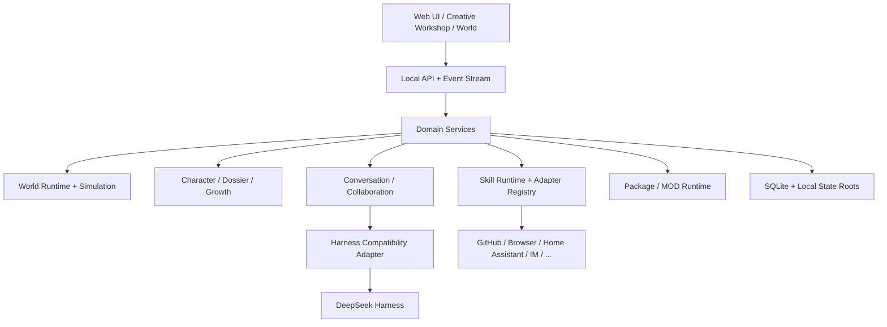

<div align="center">

# DSH Cyber

### 一个本地优先、可具身、可成长、可连接真实世界的 AI 角色与世界平台

**Build a living AI world — characters with identity, memory, bodies, skills, relationships and real actions.**

[官网](https://www.sandaoliu.cn/) · [English](./README_EN.md) · [技术报告](./docs/technical-report.md) · [Roadmap](./docs/roadmap.md) · [贡献指南](./CONTRIBUTING.md)

[](https://github.com/cyber-ai-agent/dsh-cyber/actions/workflows/ci.yml)
[](https://github.com/cyber-ai-agent/dsh-cyber/actions/workflows/full-e2e.yml)
[](https://github.com/cyber-ai-agent/dsh-cyber/stargazers)
[](./LICENSE)

> **Pre-Alpha** — 项目仍在快速重构。当前重点是把 Creative Platform V1 的架构边界做对，再进入稳定兼容阶段。

</div>

---

## 为什么做 DSH Cyber？

我们希望 AI 角色不再只是一个 Prompt。

```text
Character
├─ Identity
├─ Persona
├─ Agent Session
├─ Model Policy
├─ Embodiment
├─ Memory
├─ Relationships
├─ Skill Grants
├─ Work History
├─ Evidence
└─ Growth
```

一个角色应该能长期存在，有自己的会话、档案、身体、关系、技能和成长轨迹；进入不同世界时保持身份一致；需要调用真实世界能力时，通过受控 Skill Adapter 完成真实动作，并把结果写回可审计状态。

DSH Cyber 想把这件事做成一个**可视化、可玩、可扩展的本地 AI 世界平台**：你可以经营一家公司，也可以创建酒馆、创作工作室、家庭空间、虚拟伙伴世界，甚至通过 Skills 联动 GitHub、浏览器、Home Assistant、IM 机器人和其他真实系统。

---

## 当前已经实现

### 🧠 Persistent AI Characters

- 每个角色拥有独立 Agent session、模型策略、档案和长期身份。
- 一个角色对应一个稳定 canonical 私聊，会话可以置顶/隐藏，管家默认置顶。
- 角色可以参与真实多角色协作，不由一个“总控 Prompt”假装所有人发言。
- 角色之间的共享经历和关系证据可以持久化。

**Persistent Memory 的当前边界（请按这个理解，不要按 Memory V2 理解）：**

- **已实现**：同一个会话的最近聊天历史由本地 SQLite 恢复，可以跨应用重启、跨 Harness Runtime 重建和权限模式切换。SQLite 是会话历史的权威，DSH Session 只是当前进程内的可丢弃运行时缓存。私聊、群聊和不同世界之间不共享历史。
- **尚未实现**：Semantic Memory、Episodic Memory 分类、向量检索、Embedding、自动摘要与记忆整理。角色不会跨会话回忆，也不会主动提炼长期知识。

### 🌍 Embodied Worlds

- World Runtime + World Simulation 分层。
- PixiJS 可视化世界、状态投影、角色移动、会议、灯光与具身动作。
- deterministic role-aware ambient life，避免无意义随机走动。
- 自定义角色通过 `EmbodimentProfile` 使用语义标签绑定区域、设施、行为和动画 Rig。
- 世界、角色、Skill 三者显式解耦。

### ✨ Creative Workshop

- 顶栏独立「创意工坊」入口。
- 本地项目库：用户创建的世界项目保存在 `stateRoot/workshop`。
- 世界观、场景、角色 Persona、Embodiment 与 Skill 请求分别建模。
- Workshop 会把角色编译成标准扩展包，再经过 `PackageManager` preview / install。
- 支持基于已有项目创建安全副本，避免直接覆盖运行中的不可变历史。

### 🧩 Market / MOD Foundation

统一市场包含：

- World Themes
- Plugins
- Character Blueprints

扩展包拥有 manifest、内容哈希、权限声明、来源和安装事务。当前第三方运行入口仍以声明式能力为主，不默认执行任意 JS / shell。

### 🔌 Trusted Skill Runtime

Skill 当前采用：

```text
Available
≠ Requested
≠ Granted
≠ Approved Action
≠ Executed Action
```

已完成：

- `CharacterSkillRuntime`
- `CharacterSkillAdapterRegistry`
- 结构化 Skill Action
- risk / authorization / adapterId / status
- durable scheduling
- Home Assistant Adapter V1

外部动作只有 Adapter 返回真实执行结果后，Agent 才能告诉用户“已经完成”。

### 💾 Local-first & Safe Upgrades

本地 `stateRoot` 当前是权威数据源。

完整 `.dshbackup` 已覆盖：

```text
SQLite
worlds/
assets/
packages/
workshop/
skills/
```

凭据、运行时二进制和可重建缓存不进入普通备份。

应用源码、Harness 与用户数据拥有不同生命周期；正常升级不会通过删除本地世界来“解决问题”。

---

## 界面与世界示例

> Creative Platform V1 的 UI 仍在快速调整。下面先展示当前内置世界视觉资产；稳定后的工作台 / 创意工坊 / 角色档案截图会统一放入 `docs/assets/screenshots/`，避免 README 长期挂着已经失效的开发截图。

<table>
<tr>
<td width="50%">

<br/><b>赛博公司世界</b><br/>角色工作、协作、会议与状态会投影到可视化世界。
</td>
<td width="50%">

<br/><b>月影酒馆世界</b><br/>同一套 Character / Conversation / World Runtime 可以承载完全不同的世界语义。
</td>
</tr>
</table>

当前信息架构已经收敛为：

```text
Topbar
├─ 创意工坊
├─ 市场
├─ 运行时健康
└─ 设置

Left
└─ 会话（类似微信会话列表）

Center
└─ 对话 / 工作台

Right
├─ 世界
└─ 档案
```

市场负责安装模板和扩展；档案负责实例化、配置、授权和查看具体角色。

---

## 架构



核心不变量：

```text
World != Character != Skill != Harness
```

一个稳定 `characterId` 连接：

```text
Agent identity
= canonical direct conversation contact
= world body
= dossier
= memory owner
= growth owner
= skill grant owner
```

详细设计见：

- [技术报告](./docs/technical-report.md)
- [Creative World Platform V1](./docs/architecture/creative-world-platform-v1.md)
- [Architecture & Development Guidelines](./docs/development/architecture-guidelines.md)
- [CI Strategy](./docs/development/ci-strategy.md)

---

## 从 DeepSeek Harness 与 OpenAI Codex 吸收什么？

DSH Cyber 不把两个项目的内部实现直接复制进领域层，而是吸收它们值得长期保留的工程思想。

### DeepSeek Harness

参考 [`deepseek-ai/deepseek-harness`](https://github.com/deepseek-ai/deepseek-harness)：

- Registry / factory / scoped setup 分离；
- 能力通过稳定 Context/Provider 边界组合；
- setup 完成后再 publication；
- 生命周期和 ownership 显式；
- 不为了新增能力不断修改 Agent loop。

### OpenAI Codex

参考 [`openai/codex`](https://github.com/openai/codex)：

- sandbox-first；
- 最小权限；
- 对命令、网络、文件、工具调用等具体 Action 做审批；
- 一次授权、会话授权、策略修改拥有不同语义；
- 将风险和用户授权程度绑定到实际动作，而不是绑定整个插件。

DSH Cyber 再在上层加入：**世界、具身角色、长期记忆、关系、成长、本地所有权、MOD 和真实 Skill Action**。

---

## 快速开始

### 环境

- Node.js `22.19+` 或 `24+`
- pnpm `11.7+`

### 安装

```bash
git clone https://github.com/cyber-ai-agent/dsh-cyber.git
cd dsh-cyber
pnpm install
pnpm build
pnpm dsh-cyber -- web
```

默认监听：

```text
127.0.0.1:43123
```

常用命令：

```bash
pnpm dsh-cyber -- doctor
pnpm dsh-cyber -- backup --output ./backup.dshbackup
pnpm dsh-cyber -- web --no-open
pnpm typecheck
pnpm test
pnpm test:e2e
```

---

## 更新到最新版本，同时保留本地世界

推荐流程：

```bash
# 1. 先备份本地状态
pnpm dsh-cyber -- backup

# 2. 更新程序代码
git fetch origin
git switch main
git pull --ff-only origin main

# 3. 更新依赖并构建
pnpm install --frozen-lockfile
pnpm build

# 4. 检查本地状态
pnpm dsh-cyber -- doctor

# 5. 启动
pnpm dsh-cyber -- web
```

如果你使用自定义 `--data-dir`，升级前后继续使用**同一个目录**。

完整说明：[Local-first Upgrades](./docs/operations/local-first-upgrades.md)

### 当前开发期的兼容边界

目前仍处于 Pre-Alpha，尚未形成真实外部安装用户规模。Creative Platform V1 定型前，如果实验性旧结构严重阻碍正确架构，我们会优先做一次干净重构，而不是永久背负大量只服务于开发快照的兼容补丁。

**从正式声明本地数据兼容基线的版本开始**，所有持久化变更都必须使用 versioned migration + backup / restore 验证，正常升级不得清空用户数据。

---

## 模型与 Harness

模型配置支持多种供应商与 OpenAI-compatible endpoints，并允许：

```text
Employee model
  > World model
    > Workspace default
      > Default model profile
```

Harness 被限制在兼容适配层，不允许世界、角色、Skill 领域代码依赖 Harness 私有 API。

底层 Harness 更新支持候选版本检查、contract test、canary、人工激活、完整本地备份和 rollback。

---

## 开发状态 / TODO

完整列表见 [Roadmap](./docs/roadmap.md)。当前重点：

- [ ] Creative Platform V1 稳定化
- [ ] Workshop 项目版本与编辑生命周期
- [ ] Character Identity / Persona / Embodiment 完全以用户当前设定为准
- [ ] Persistent Memory V2
- [ ] Task / Job / Deliverable / Review 工作系统
- [ ] GitHub Skill Adapter
- [ ] Browser Skill Adapter
- [ ] 飞书 / QQ / 微信 Channel Adapter
- [ ] Autonomous Collaboration Policy
- [ ] MOD 远程索引、签名、依赖与更新
- [ ] 自定义角色 Body / Rig / 动画资产
- [ ] 未来 3D 世界能力
- [ ] 可选加密云同步（本地仍为权威）

---

## 开发规范

我们希望这个项目越做越大，但不要越做越难改。

几个硬规则：

1. **不要通过角色名字写业务逻辑。**
2. **不要在核心 Runtime 里堆供应商 `if/else`。**
3. **requested capability 与 granted capability 必须分离。**
4. **外部真实动作必须结构化、可审批、可审计。**
5. **复杂 UI 继续拆组件，不把状态全部塞回 `App.tsx`。**
6. **新增持久化目录必须同步进入备份策略。**
7. **兼容基线之后，schema 变化必须有 migration。**
8. **测试产品契约，减少对按钮位置和 DOM 排列的耦合。**

详细规范：

- [`AGENTS.md`](./AGENTS.md)
- [`docs/development/architecture-guidelines.md`](./docs/development/architecture-guidelines.md)
- [`docs/development/ci-strategy.md`](./docs/development/ci-strategy.md)
- [`CONTRIBUTING.md`](./CONTRIBUTING.md)

---

## CI 策略

项目当前处于快速架构期，因此 CI 分层：

```text
Required PR CI
└─ typecheck + unit/integration

Full Chromium E2E
├─ main push
├─ nightly
└─ manual dispatch
```

当前已经有 200+ unit/integration tests。进入 Alpha 后会增加少量核心 Smoke E2E 为 Required；进入 Beta / Stable 后再逐步把完整 E2E、migration、backup/restore、OS matrix 和 Harness Canary 收紧为发布门禁。

---

## 项目方向

我们希望最后得到的不只是一个“多 Agent 面板”。

更接近：

```text
AI Character Platform
+ Visual World Simulation
+ Persistent Memory & Growth
+ MOD Ecosystem
+ Real-world Skill Runtime
+ Harness Runtime
```

你可以创建一家公司，也可以创建一只长期陪伴你的猫、一个酒馆老板、一个内容工作室、一支开发团队，或者完全不同的世界。

角色会有自己的经历，会记住发生过的事情，会形成关系，会通过真实工作积累证据和成长；当被授权时，它们还能通过 Skills 跨出虚拟世界，真正操作现实系统。

---

## Contributing

项目仍然非常早期，架构讨论、世界设计、Character / MOD 设计、Skill Adapter、测试、文档和 UI 都欢迎贡献。

请先阅读 [CONTRIBUTING.md](./CONTRIBUTING.md) 和 [Architecture Guidelines](./docs/development/architecture-guidelines.md)。重大领域变化建议先讨论边界，再写实现。

---

## Links

- Website: https://www.sandaoliu.cn/
- Repository: https://github.com/cyber-ai-agent/dsh-cyber
- DeepSeek Harness: https://github.com/deepseek-ai/deepseek-harness
- OpenAI Codex: https://github.com/openai/codex

---

<div align="center">

**DSH Cyber is still early. That is exactly why we are investing in the architecture now.**

</div>
