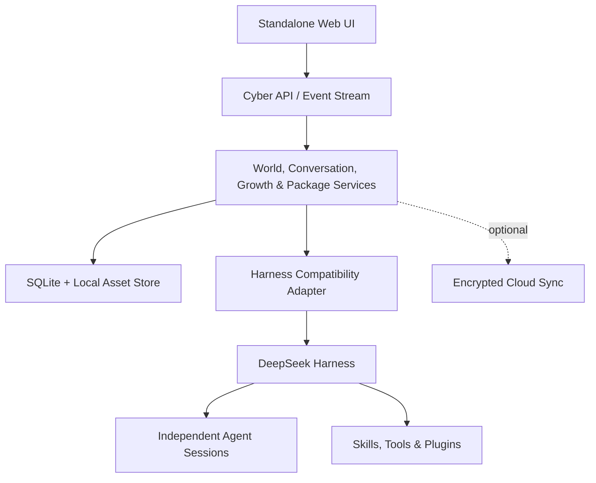

# DSH Cyber

DSH Cyber 是一个基于 [DeepSeek Harness](https://www.deepseek.com/harness/) 的本地优先、多角色智能体工作台。它提供独立 Web 界面，把真实 Agent 会话、思考过程、工具轨迹、文件与可视化世界整合为一个可持续使用的桌面式工作空间。

> 当前版本处于早期开发阶段，适合本地体验、架构验证与共同开发，尚未发布到 npm。

## 核心能力

- **独立工作台**：不依赖 DSH 原生 Web 界面，一条命令启动本地 Web UI。
- **真实多角色协作**：每个角色拥有独立身份、会话、模型策略、权限和成长档案；主 Agent 不冒充其他角色。
- **世界隔离**：公司、酒馆、创作工作室等世界拥有各自的角色、会话、关系和 `@` 候选列表，切换世界会进入独立上下文。
- **会话与轨迹同屏**：对话、思考、工具调用、交付物和状态事件集中在主工作区。
- **可调整工作台**：左侧世界与会话、中间对话、右侧世界/档案/文件/预览均可适配窗口宽度，桌面分栏支持拖动，超宽屏会同步扩大侧栏和阅读密度。
- **员工成长档案**：全员档案库集中展示身份、生日、性格、技能证据、里程碑、工作日志与关系；技能必须由真实任务或评审证据支撑。
- **世界可视化**：侧栏聚焦视口与全屏地图共享同一事实投影，角色位置、会议、交接和工作状态由真实事件驱动，不使用无状态随机表演。
- **安全文件预览**：只读浏览当前工作区的允许目录，文本、代码和图片可以在侧栏预览或新标签打开；隐藏文件、凭据、符号链接和越界路径默认拒绝。
- **本地软件包市场**：导入本地包前展示来源、许可证、文件变化、权限和数据出境声明，只有精确批准后才安装，失败保留可审计回滚记录。
- **本地优先存储**：SQLite 保存工作区、世界、角色、会话索引、偏好、档案与授权；核心功能不依赖云端账户。
- **可扩展生态**：为运行时插件、技能包、角色蓝图、世界主题和资产包预留统一的安装、授权与审计边界。

## 设置与个性化

右上角的“设置”统一管理工作台配置：

- 跟随系统、白天和黑夜三种颜色模式；
- 赛博石墨、午夜紫、纸张日光等界面皮肤；
- 上传 PNG、JPEG 或 WebP 作为本地背景，并设置铺满、完整显示或平铺、透明度和动效；
- 紧凑/舒适密度，以及左右栏宽度；
- 默认模型与 OpenAI 兼容本地模型；
- DSH 运行时、本地数据和更新状态入口。

界面偏好和模型资料保存在本地 SQLite。背景文件保存在本机资产目录，数据库只记录引用和完整性校验值。模型凭据只通过环境变量名引用，不写入浏览器状态或数据库明文。

## 快速开始

### 环境要求

- Node.js `22.19+` 或 `24+`
- pnpm `11.7+`
- 可用的 DeepSeek Harness 开发环境（执行真实 Agent 时需要）

### 安装与启动

```bash
git clone git@github.com:cyber-ai-agent/dsh-cyber.git
cd dsh-cyber
pnpm install
pnpm build
pnpm dsh-cyber -- web
```

服务默认监听 `127.0.0.1:43123` 并自动打开浏览器。常用参数：

```bash
pnpm dsh-cyber -- web --port 43123 --workspace . --data-dir ./data --no-open
pnpm dsh-cyber -- doctor --data-dir ./data
pnpm dsh-cyber -- backup --data-dir ./data --output ./backup.sqlite
pnpm dsh-cyber -- export --data-dir ./data --output ./workspace.json
```

默认数据目录：

- Windows：`%LOCALAPPDATA%\DSH Cyber`
- macOS / Linux：`~/.dsh-cyber`

### 开发验证

```bash
pnpm typecheck
pnpm test
pnpm test:e2e
pnpm verify
```

## 使用模型

在“设置 → 模型”中可以登记本地 OpenAI 兼容服务，例如 Ollama、LM Studio 或其他仅监听本机的兼容接口。远程模型地址必须使用 HTTPS；本地模型地址仅允许环回地址。需要密钥时填写环境变量名，例如 `LOCAL_MODEL_API_KEY`，然后在启动 DSH Cyber 前设置该环境变量。员工的新角色版本可以固定使用指定模型资料，也可以跟随工作区默认模型；密钥值不会进入员工档案或浏览器状态。

## 数据与隐私

- SQLite 是本地权威数据源；云同步是未来可选的加密副本，不替代本地所有权。
- 大型文件和背景图片单独存储，并以内容校验值关联。
- 服务默认只监听 loopback，不提供公网监听开关。
- 插件与角色使用显式、最小权限授权。
- 不可逆操作（发布、付款、外部消息、删除）需要审批或可补偿控制。
- 请勿把 `.env`、数据库、运行日志、私钥或本地工作区数据提交到仓库。

## 架构



上层产品只依赖 DSH Cyber 的领域契约和适配器端口。DeepSeek Harness 被限制在兼容适配层和专用 bundle/profile 中，从而允许底层 DSH 升级先经过候选环境、契约测试、回归测试和回滚检查，再切换活动版本。

## 包类型

| 类型 | 用途 |
| --- | --- |
| Runtime Plugin | 模型、工具、通道、存储等 DSH 能力 |
| Skill Pack | 可复用指令、参考资料和工作流 |
| Employee Blueprint | 可招聘的独立角色模板、能力要求与评测规则 |
| World Theme | 世界布局、术语、场景与事件动画映射 |
| Asset Pack | 头像、服装、场景、声音等授权素材 |

安装包、启用包、授予世界权限和员工掌握技能是不同状态。市场条目需要经过来源、完整性、许可证、权限和运行行为检查，不能仅凭发现来源视为可信。

## DeepSeek Harness 兼容性

DSH Cyber 遵循 Harness 的插件、服务、事件、技能、子代理和会话投影模型：

- [DeepSeek Harness](https://www.deepseek.com/harness/)
- [官方仓库](https://github.com/deepseek-ai/deepseek-harness)
- [Quick start](https://deepseek-harness.github.io/deepseek-harness/guide/quickstart)
- [Architecture](https://github.com/deepseek-ai/deepseek-harness/blob/master/docs/architecture.md)
- [Plugin development](https://github.com/deepseek-ai/deepseek-harness/blob/master/docs/user/develop/basic/index.md)
- [Skills](https://github.com/deepseek-ai/deepseek-harness/blob/master/docs/subsystems/skills.md)
- [Subagents](https://github.com/deepseek-ai/deepseek-harness/blob/master/docs/subsystems/subagent.md)
- [Session projections](https://github.com/deepseek-ai/deepseek-harness/blob/master/docs/subsystems/session-projection.md)
- [Cordis paper](https://github.com/cordiverse/paper)

Harness 仍处于开发者预览阶段。DSH Cyber 的发布版本将维护明确的兼容矩阵，不假定上游内部 API 稳定。

## 贡献

提交变更前请运行 `pnpm verify`，并确认没有包含凭据、私有会话、数据库或本地运行目录。兼容性问题请同时提供 DSH 版本、操作系统、复现步骤和经过脱敏的诊断输出。

## 许可证

DSH Cyber 使用 [PolyForm Noncommercial License 1.0.0](./LICENSE)，不授权商业用途。商业使用需要获得版权所有者的单独书面许可。

本项目不是 DeepSeek 官方项目。第三方组件与参考项目仍受各自许可证约束，详见 [THIRD_PARTY_NOTICES.md](./THIRD_PARTY_NOTICES.md)。
