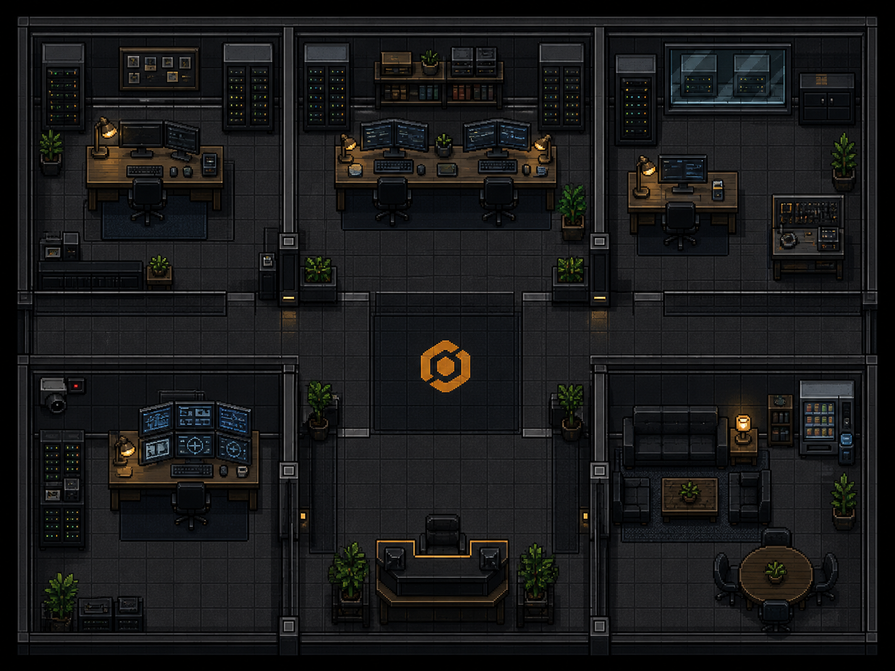
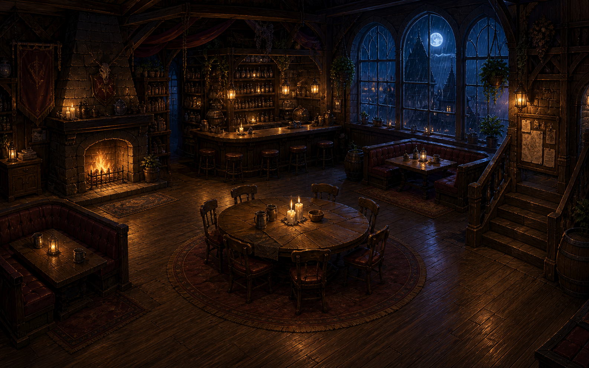
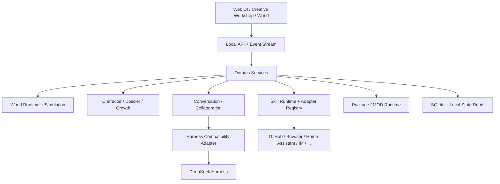

<div align="center">

# DSH Cyber

### A local-first platform for embodied, persistent and extensible AI characters

**Build a living AI world — characters with identity, memory, bodies, skills, relationships and real actions.**

[Website](https://www.sandaoliu.cn/) · [中文](./README.md) · [Technical Report](./docs/technical-report.md) · [Roadmap](./docs/roadmap.md) · [Contributing](./CONTRIBUTING.md)

[](https://github.com/cyber-ai-agent/dsh-cyber/actions/workflows/ci.yml)
[](https://github.com/cyber-ai-agent/dsh-cyber/actions/workflows/full-e2e.yml)
[](https://github.com/cyber-ai-agent/dsh-cyber/stargazers)
[](./LICENSE)

> **Pre-Alpha** — the architecture is still evolving quickly. The current priority is to make the Creative Platform V1 boundaries correct before locking long-term compatibility.

</div>

---

## Why DSH Cyber?

We do not want an AI character to be only a prompt preset.

```text
Character
├─ Identity
├─ Persona
├─ Agent Session
├─ Model Policy
├─ Embodiment
├─ Memory
├─ Relationships
├─ Skill Grants
├─ Work History
├─ Evidence
└─ Growth
```

A character should persist over time, keep its own conversation and dossier, inhabit a visual world, form relationships, gain skills from evidence, and perform real actions through trusted integrations when the user allows it.

DSH Cyber is building this as a **visual, local-first, moddable AI world platform**. A world may be a company, a tavern, a creator studio, a home, a companion space or something entirely different. Trusted Skills can eventually connect selected characters to GitHub, browsers, Home Assistant, messaging channels and other real systems.

---

## What already works

### Persistent characters and conversation continuity

- Independent Agent sessions, model policies and dossiers.
- One canonical direct conversation per active character.
- Pinned/hidden conversations, with the butler pinned by default.
- Real multi-character conversations and bounded peer collaboration.
- Persistent shared episodes and relationship evidence.

#### Conversation continuity

- Recent chat history from one conversation is restored from local SQLite across application restarts, Harness runtime rebuilds and permission-mode switches. SQLite is authoritative; a DSH session is a disposable runtime cache. Direct chats, group meetings and separate worlds never share history.
- Cross-conversation recall, semantic or episodic memory, vector retrieval, embeddings, automatic summarisation and memory consolidation are not available yet.

### Embodied worlds

- World Runtime and World Simulation are separated.
- PixiJS world rendering and runtime projection.
- Deterministic role-aware ambient life instead of random wandering.
- Explicit semantic `EmbodimentProfile` for custom roles.
- World, Character and Skill are separate domains.

### World-scoped administration

- Each World has one or more `World Administrator` characters. Their role and 18 fine-grained World Permissions are persisted by SQLite `WorldCharacterAuthority`, with an append-only audit ledger and a last-active-administrator invariant.
- Authority is isolated to the current World. It is not an application-admin role, an Approval Reviewer role, or a Skill Grant. A World Administrator can receive current-World `workspace-write` access, but never automatic `danger-full-access`.
- A missing World Permission can be requested from the active chat. The choice is one-time, persistent, or reject; approval resumes the original WorkTurn and does not replay the user's entire turn. External side effects still use the existing Approval Gate.
- The trusted `builtin.world-management` adapter handles narrowly scoped World settings, character, package-instance, and model-assignment actions. `settings.json` uses revision checks, while SQLite remains authoritative for model assignments.

### Creative Workshop

- A dedicated global Creative Workshop entry.
- Local project library stored under `stateRoot/workshop`.
- World lore, scenario, Persona, Embodiment and requested Skills are modeled independently.
- Workshop characters compile into standard extension packages and still pass through `PackageManager` preview/install.
- Existing projects can be duplicated safely while versioned in-place project editing is still being designed.

### Market / MOD foundation

The unified market can host:

- World Themes
- Plugins
- Character Blueprints

Packages use manifests, content hashes, permission declarations and installation transactions. Third-party content is declarative by default; arbitrary JavaScript or shell execution is not silently enabled.

### Trusted Skill Runtime

```text
Available
≠ Requested
≠ Granted
≠ Approved Action
≠ Executed Action
```

Implemented foundations include:

- `CharacterSkillRuntime`
- `CharacterSkillAdapterRegistry`
- structured Skill Actions
- risk / authorization / adapterId / status
- durable scheduling
- Home Assistant Adapter V1

An Agent may only claim an external action succeeded after the trusted Adapter reports a factual execution result.

### World artifacts

- A role run or the owner can explicitly publish a result from the current World workspace. SQLite keeps its stable identity, provenance, versions and conversation linkage; published files are immutable World-local versions.
- Final replies can include artifact cards. Opening one uses a format-aware reader for Markdown, code, structured JSON, PDF, images, sandboxed HTML or a project file tree.
- Artifacts stay isolated by World and are included through SQLite plus `worlds/` in local backups. Workspace scratch files are never discovered or published automatically.
- Knowledge currently has a real navigation entry and empty state only. Artifacts are not automatically promoted into knowledge.

### Local-first persistence and safe upgrades

The local `stateRoot` is the current source of truth.

A `.dshbackup` includes:

```text
SQLite
worlds/
assets/
packages/
workshop/
skills/
```

Credentials, runtime binaries and rebuildable caches are excluded from normal backups.

Program code, the Harness runtime and user data have separate lifecycles.

---

## Visual world examples

> Creative Platform V1 UI is still changing rapidly. These are current built-in world assets. Stable Workbench / Creative Workshop / Dossier screenshots will be kept under `docs/assets/screenshots/` once the UI settles, so the README does not permanently show obsolete development UI.

<table>
<tr>
<td width="50%">

<br/><b>Cyber Office</b><br/>Work, collaboration, meetings and runtime state can be projected into the world.
</td>
<td width="50%">

<br/><b>Moonlit Tavern</b><br/>The same Character / Conversation / World Runtime contracts can support a completely different world.
</td>
</tr>
</table>

Current information architecture:

```text
Topbar
├─ Creative Workshop
├─ Market
├─ Runtime health
└─ Settings

Left
└─ Conversations only

Center
└─ Chat / workbench

Right
├─ World
├─ Dossier
├─ Knowledge
├─ Artifacts
├─ Trace
└─ Schedule
```

Market installs templates and extensions. Dossier manages concrete character instances, configuration and grants.

---

## Architecture



Core invariant:

```text
World != Character != Skill != Harness
```

A stable `characterId` links:

```text
Agent identity
= canonical direct conversation contact
= world body
= dossier
= memory owner
= growth owner
= skill grant owner
```

Read more:

- [Technical Report](./docs/technical-report.md)
- [Creative World Platform V1](./docs/architecture/creative-world-platform-v1.md)
- [World Artifact Center V1](./docs/architecture/world-artifact-center-v1.md)
- [Architecture Guidelines](./docs/development/architecture-guidelines.md)
- [CI Strategy](./docs/development/ci-strategy.md)

---

## Design influences: DeepSeek Harness and OpenAI Codex

DSH Cyber does not copy their private implementation details into its domain model. It studies the architectural ideas that remain useful at platform scale.

### DeepSeek Harness

Reference: [`deepseek-ai/deepseek-harness`](https://github.com/deepseek-ai/deepseek-harness)

Ideas we value:

- registry / factory / scoped setup separation;
- capability composition at stable context/provider boundaries;
- complete setup before publication;
- explicit lifecycle ownership;
- adding capability without continuously rewriting the Agent loop.

### OpenAI Codex

Reference: [`openai/codex`](https://github.com/openai/codex)

Ideas we value:

- sandbox-first execution;
- least privilege;
- approvals for concrete commands, network access, file changes and tool calls;
- different semantics for one-shot, session and policy-level authorization;
- risk and user authorization attached to actions rather than granting unlimited trust to an installed plugin.

DSH Cyber adds a product domain above those ideas: embodied worlds, persistent identity, relationships, memory, growth, local ownership, MODs and real-world Skill Actions.

---

## Quick start

Requirements:

- Node.js `22.19+` or `24+`
- pnpm `11.7+`

```bash
git clone https://github.com/cyber-ai-agent/dsh-cyber.git
cd dsh-cyber
pnpm install
pnpm build
pnpm dsh-cyber web
```

Default local address:

```text
127.0.0.1:43123
```

Useful commands:

```bash
pnpm dsh-cyber doctor
pnpm dsh-cyber backup --output ./backup.dshbackup
pnpm dsh-cyber web --no-open
pnpm typecheck
pnpm test
pnpm test:e2e
```

---

## Upgrade without losing local worlds

```bash
# 1. Back up local state
pnpm dsh-cyber backup

# 2. Update program code
git fetch origin
git switch main
git pull --ff-only origin main

# 3. Install and build
pnpm install --frozen-lockfile
pnpm build

# 4. Validate local state
pnpm dsh-cyber doctor

# 5. Start
pnpm dsh-cyber web
```

If you use a custom `--data-dir`, keep using the **same directory** after upgrading.

See [Local-first Upgrades](./docs/operations/local-first-upgrades.md).

### Current compatibility boundary

The project is still Pre-Alpha and does not yet have a meaningful external installed-user compatibility burden. Before Creative Platform V1 is declared stable, a clearly documented clean refactor is preferable to accumulating permanent migration patches for experimental development-only snapshots.

**After the first declared local-data compatibility baseline**, persisted schema changes must use versioned migrations plus backup/restore validation. Normal upgrades must not wipe user data.

---

## Model routing and Harness

Model profiles support multiple providers and OpenAI-compatible endpoints.

Routing priority:

```text
Employee model
  > World model
    > Workspace default
      > Default model profile
```

Harness internals remain behind a compatibility adapter. World, Character and Skill domain code should not depend on Harness private APIs.

Harness runtime updates support candidate inspection, contract tests, canary validation, explicit activation, full local backup and rollback.

---

## Development TODO

See the full [Roadmap](./docs/roadmap.md).

Current priorities:

- [ ] stabilize Creative Platform V1
- [ ] Workshop project versioning and edit lifecycle
- [ ] make current user-defined Character Identity / Persona / Embodiment authoritative everywhere
- [ ] cross-conversation episodic and semantic memory
- [ ] Task / Job / Deliverable / Review work system
- [ ] GitHub Skill Adapter
- [ ] Browser Skill Adapter
- [ ] Feishu / QQ / WeChat Channel Adapters
- [ ] Autonomous Collaboration Policy
- [ ] remote MOD index, signatures, dependencies and updates
- [ ] custom character body / rig / animation assets
- [ ] future 3D world capability
- [ ] optional encrypted cloud sync while local remains authoritative

---

## Engineering rules

We want the project to become larger without becoming harder to change.

1. Do not implement business logic from character display names.
2. Do not accumulate provider-specific `if/else` branches in the core runtime.
3. Keep requested and granted capabilities separate.
4. Real side effects must be structured, reviewable and auditable.
5. Keep complex UI state out of the composition root.
6. Every new persistent root must join the backup strategy.
7. After the compatibility baseline, persisted schema changes require migrations.
8. Test product contracts more than fragile DOM layout details.

Read:

- [`AGENTS.md`](./AGENTS.md)
- [Architecture Guidelines](./docs/development/architecture-guidelines.md)
- [CI Strategy](./docs/development/ci-strategy.md)
- [`CONTRIBUTING.md`](./CONTRIBUTING.md)

---

## CI strategy

During the current architecture-heavy Pre-Alpha phase:

```text
Required PR CI
└─ typecheck + unit/integration

Full Chromium E2E
├─ main push
├─ nightly
└─ manual dispatch
```

There are already 200+ unit/integration tests. Alpha will add a small Required Smoke E2E suite. Beta/Stable will progressively require full E2E, migrations, backup/restore, OS matrices and Harness canaries.

---

## Where this is going

The long-term target is closer to:

```text
AI Character Platform
+ Visual World Simulation
+ Persistent Memory & Growth
+ MOD Ecosystem
+ Real-world Skill Runtime
+ Harness Runtime
```

You may create a company, a persistent companion cat, a tavern owner, a content studio, a developer team, or a world we have never imagined.

Characters should accumulate experiences, remember meaningful events, form relationships and grow from real evidence. When explicitly authorized, they should also be able to cross the simulated boundary and operate real systems through trusted Skills.

---

## Contributing

The project is still early. Architecture discussions, world design, Character/MOD design, Skill Adapters, tests, docs and UI contributions are all welcome.

Please read [CONTRIBUTING.md](./CONTRIBUTING.md) and the [Architecture Guidelines](./docs/development/architecture-guidelines.md) first. For major domain changes, discuss the boundary before adding implementation.

---

## Links

- Website: https://www.sandaoliu.cn/
- Repository: https://github.com/cyber-ai-agent/dsh-cyber
- DeepSeek Harness: https://github.com/deepseek-ai/deepseek-harness
- OpenAI Codex: https://github.com/openai/codex

---

<div align="center">

**DSH Cyber is still early. That is exactly why we are investing in the architecture now.**

</div>
