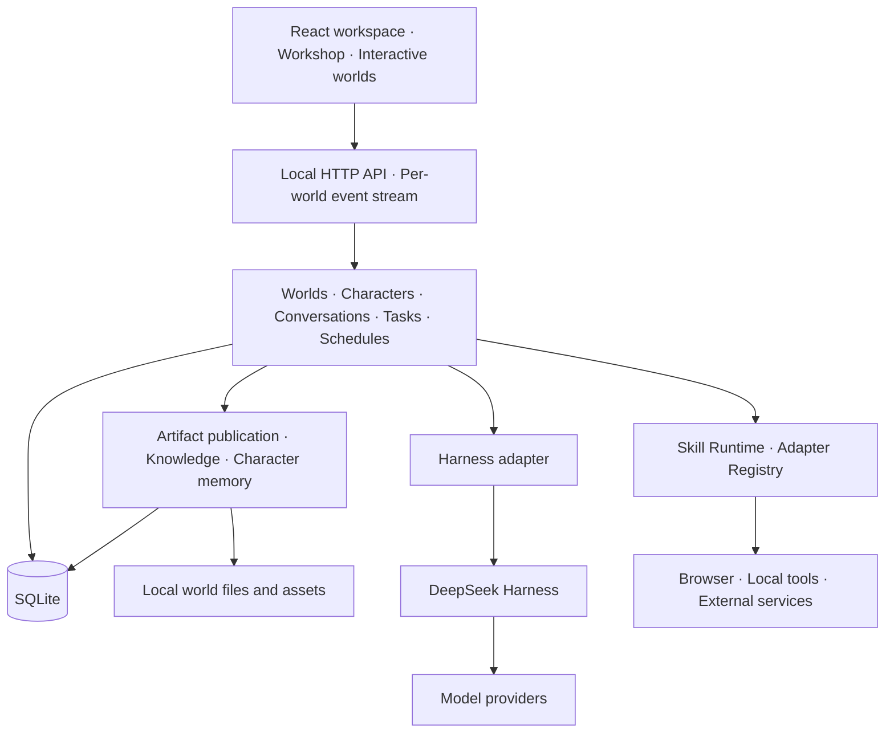

<div align="center">

# DSH Cyber

**A local-first workspace for persistent AI characters**

Create characters with identity and memory, collaborate in interactive worlds, and keep the results of real work.

[Website](https://www.sandaoliu.cn/) · [Windows desktop download](https://github.com/cyber-ai-agent/dsh-cyber/releases/tag/desktop-v0.1.0-preview.1) · [简体中文](./README.md) · [Contributing](./CONTRIBUTING.md)

[](https://github.com/cyber-ai-agent/dsh-cyber/actions/workflows/ci.yml)
[](./LICENSE)

</div>

DSH Cyber builds on [DeepSeek Harness](https://github.com/deepseek-ai/deepseek-harness), organizing model and tool execution into worlds, characters, conversations, and work results. Use it for a personal assistant space, a development team, a content studio, or a narrative world.

The project is **Pre-Alpha**. APIs and features are evolving. Bring your own model connection; results depend on the selected model, tool permissions, and local environment.

## Screenshots


*The current workspace in the deep-sea Orca Link skin: conversations on the left, character deliverables in the center, the interactive world on the right, and the complete composer in view.*


*Sample files opened through the actual publication and preview flow. Screenshots use isolated demonstration data.*

## Capabilities

| Capability | Purpose |
| --- | --- |
| Persistent characters | Configure identity, responsibilities, models, and skills, with independent chats and histories. |
| Collaboration | Discuss and execute work in a shared world while inspecting each character’s actual run state. |
| Interactive worlds | Visualize work context; switching worlds also switches conversations and resources. |
| Artifacts | Register real files as referenceable versions and preview documents, images, code, and isolated web pages. |
| Knowledge and memory | Import reference material, extract source-backed knowledge, and preserve character-owned conversation memory. |
| Tasks and schedules | Organize plans, assignments, deliverables, and reviews; schedule work with durable run records. |
| Workshop and market | Generate and review world, character, skin, and plugin drafts, then create, recruit, activate, or apply them through a shared package system. |
| Model hub | Manage provider connections and model selection with locally encrypted credentials. |
| Windows desktop preview | Run the same local workspace in a single-instance desktop window with tray background mode, explicit quit, and a backup before the first launch of a new desktop version. |

Models are assigned per character in **Tools → Model Hub**. The chat composer uses the active character's assignment directly.

Chat shows conversational results. Trace explains execution. An artifact must correspond to a real file; a model’s claim is not evidence that a tool succeeded or a task finished.

## Core ideas

**Characters are persistent entities.** Identity, private chat, model policy, memory, skill grants, and work history share a stable character ID. Worlds maintain separate data and character boundaries.

**Local data belongs to the user.** SQLite stores conversation and domain facts. Local files store worlds, source documents, artifacts, and packages. Program files and user data live separately. Backups include the database and user assets; credentials and reinstallable runtime caches are managed separately.

**Capability is distinct from authority.** Installing a plugin, requesting a skill, granting a skill, and approving one action have different meanings. Trusted adapters record the authorization and outcome of real actions.

| Conversation permission | File and command scope |
| --- | --- |
| Read-only access | Read and search; modifications require separate approval. |
| Current world | Read and write in the world’s project directory; operations outside it require approval. |
| Full access | Access files and execute commands within the system account’s privileges, without tool approval. Requires explicit confirmation. |

These map to native DSH modes. Current-world mode retains DSH’s platform temporary-directory exceptions. Unattended schedules cannot use full access. External Skill actions retain their own authorization and approval checks.

**Visualization does not replace evidence.** Movement and animation help explain work. Tasks, runs, artifact versions, and reviews are recorded independently. Failures must be diagnosable, and retries must not duplicate external side effects.

## Architecture



- **Frontend:** TypeScript, React, Vite, PixiJS worlds, and optional 3D loaded on demand.
- **Backend:** a local Node.js service with separate orchestration, durable queues, and completion processing.
- **Storage:** SQLite, versioned migrations, local assets, and complete backups.
- **Runtime:** DeepSeek Harness SDK workers behind a compatibility adapter.
- **Validation:** Vitest contracts and service tests, Playwright user flows, and build budgets.

| Directory | Responsibility |
| --- | --- |
| `packages/contracts` | Domain types and interface contracts |
| `packages/orchestration` | Conversations, character runs, and collaboration |
| `packages/persistence` | SQLite storage, queues, and migrations |
| `packages/harness-adapter`, `packages/harness-bundle` | DSH compatibility and worker composition |
| `packages/server`, `packages/cli` | Local API, services, and command line |
| `packages/web`, `packages/world-runtime` | Workspace UI and world runtime |
| `packages/package-runtime`, `packages/catalog`, `marketplace` | Extension packages and built-in catalogs |
| `apps/desktop` | Windows shell, self-contained runtime packaging, and window tests |

DSH is pinned to `0.1.7-rc.2`. Upstream remains in prerelease status. Runtime upgrades require compatibility checks and real worker tests.

See the [current compatibility notes](./docs/development/deepseek-harness-compatibility-2026-09-26.md) for the upgrade evidence.

## Quick start

Use Node.js 22.19+ on the 22 LTS line, or 24+, and the project’s pnpm 11 version.

```bash
git clone https://github.com/cyber-ai-agent/dsh-cyber.git
cd dsh-cyber
pnpm install --frozen-lockfile
pnpm build
pnpm dsh-cyber web
```

Open the [local workspace](http://127.0.0.1:43123), configure a provider connection and model in the model hub, and enter a world.

On Windows x64, download the desktop preview [installer](https://github.com/cyber-ai-agent/dsh-cyber/releases/download/desktop-v0.1.0-preview.1/DSH-Cyber-Setup-0.1.0-preview.1-win-x64.exe), [portable ZIP](https://github.com/cyber-ai-agent/dsh-cyber/releases/download/desktop-v0.1.0-preview.1/DSH-Cyber-Portable-0.1.0-preview.1-win-x64.zip), and [SHA-256 checksums](https://github.com/cyber-ai-agent/dsh-cyber/releases/download/desktop-v0.1.0-preview.1/SHA256SUMS.txt). See the [desktop guide](./apps/desktop/README.md) for installation and source builds. Preview binaries are unsigned and do not auto-update.

For local voice, also run `pnpm voice:install`. Voice models load on demand; the conversation model uses your configured provider.

```bash
pnpm dsh-cyber doctor
pnpm dsh-cyber web --no-open
pnpm typecheck
pnpm test
pnpm test:e2e
```

Default data locations are `%LOCALAPPDATA%\DSH Cyber` on Windows and `~/.dsh-cyber` on macOS/Linux. Use `--data-dir` to choose another directory.

## Updates and backups

Back up before updating:

```bash
pnpm dsh-cyber backup
git pull --ff-only
pnpm install --frozen-lockfile
pnpm build
pnpm dsh-cyber doctor
pnpm dsh-cyber web
```

Stop the previous service before updating. If you use a custom data directory, keep the same `--data-dir` for backup and restart. These commands update program files without clearing worlds, conversations, or assets. See [local upgrades and recovery](./docs/operations/local-first-upgrades.md).

## Contributing and license

Contributions to features, themes, packages, tests, and documentation are welcome. Read [Contributing](./CONTRIBUTING.md) and the [architecture guidelines](./docs/development/architecture-guidelines.md). Product direction is documented in the [Roadmap](./docs/roadmap.md).

DSH Cyber is licensed under the [PolyForm Noncommercial License 1.0.0](./LICENSE). Commercial use requires separate authorization. Thanks to [DeepSeek Harness](https://github.com/deepseek-ai/deepseek-harness) for the underlying runtime.
