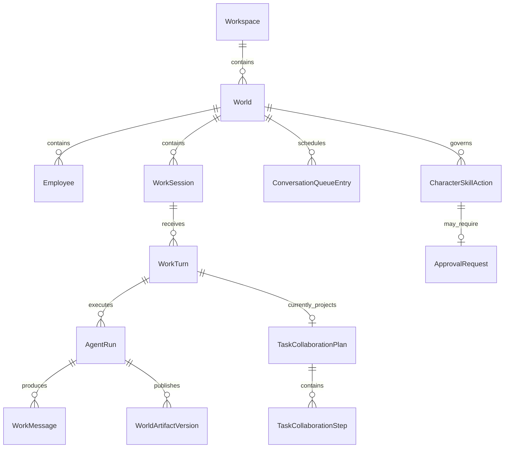
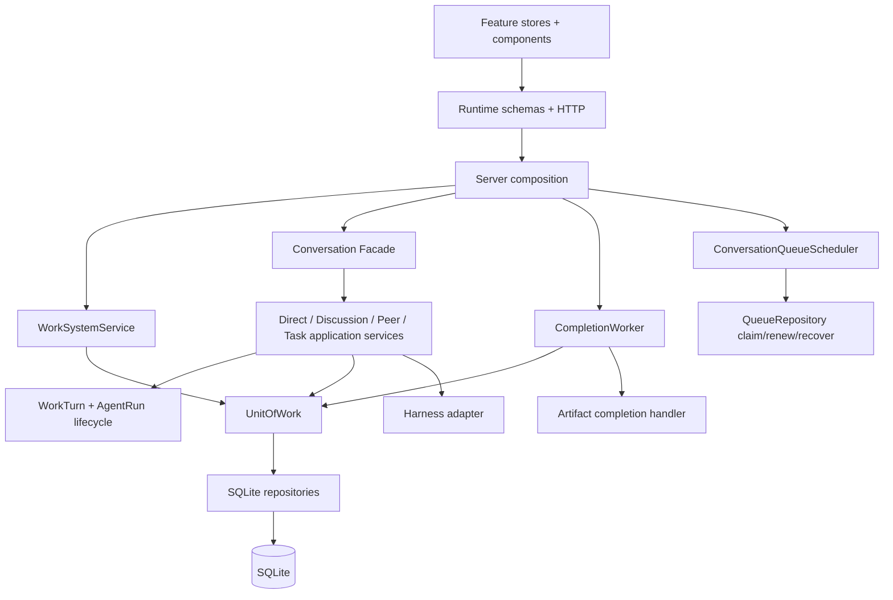
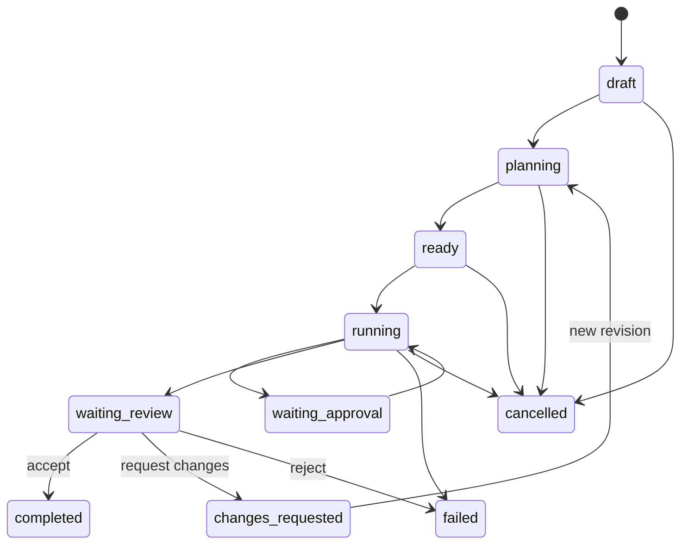

# DSH Cyber Core Reliability & Work System V1

- 状态：V1 主闭环已实现；完整兼容基线与全量发布矩阵仍在验收
- 基线：`main@ebf486917e92e811eccd9cdcf7d90337fc549dc2`
- 分支：`feat/core-reliability-work-system-v1`
- 日期：2026-08-27

## 1. 目标与边界

本阶段把已有的会话、群聊任务路由、审批、Artifact、Trace、Package 和本地备份能力收敛为一个可恢复的数字员工工作闭环：

```text
Task
  -> TaskPlanRevision / PlanStep
  -> Assignment
  -> TaskRun
  -> existing WorkTurn
  -> existing AgentRun
  -> immutable ArtifactVersion
  -> immutable DeliverableVersion
  -> Review
  -> Evidence / GrowthEvidence
```

Work System 不创建第二套 Agent 执行器。`WorkTurn` 和 `AgentRun` 继续是实际执行事实；Task、Plan、Assignment、Deliverable 和 Review 只负责业务编排、关联、验收和恢复。

本阶段保持：SQLite、本地 `stateRoot`、现有 Harness Adapter、世界隔离、每角色最多两条运行通道、同会话顺序锁、审批 continuation、PackageManager 和单条 `/live` SSE。

不在范围内：微服务、PostgreSQL、云账户/同步、向量数据库、任意第三方代码执行、完整自主经营循环、完整 Memory & Growth V2、远程签名更新平台和大规模视觉重做。

## 2. 当前架构

```mermaid
flowchart TB
  WEB[Web App / App.tsx] --> HTTP[createCyberServer / routes]
  HTTP --> ORCH[ConversationOrchestrator]
  HTTP --> SERVICES[Domain services]
  ORCH --> HARNESS[HarnessCompatibilityAdapter]
  ORCH --> STORE[SqliteStore]
  SERVICES --> STORE
  SERVICES --> PKG[PackageManager / LocalPackageRuntime]
  SERVICES --> SKILL[CharacterSkillRuntime / Adapter Registry]
  STORE --> DB[(SQLite schema 27)]
  PKG --> FS[stateRoot/packages]
  SERVICES --> WORLD[stateRoot/worlds]
  ORCH --> LIVE[/worlds/:id/live]
  LIVE --> WEB
```

当前已确认的集中点：

| 组件 | 基线规模 | 当前职责问题 |
| --- | ---: | --- |
| `sqlite-store.ts` | 264005 bytes | schema、repository、事务和产品编排混合 |
| `conversation-orchestrator.ts` | 74190 bytes | Direct/Discussion/Task、生命周期、Runtime 事件和完成钩子混合 |
| `server.ts` | 32278 bytes | 安全、持久化、包、Skill、知识、调度器和 HTTP 组合混合 |
| `App.tsx` | 139734 bytes | 服务端快照、实时流、局部 UI、Queue 与多个 Feature 组合混合 |

## 3. 当前领域模型



现有 `TaskCollaborationPlan` 是群聊单回合的轻量执行投影。迁移后它由正式 `TaskPlanRevision`/`TaskPlanStep` 取代或关联；禁止长期保留两套含义相同的计划模型。

## 4. 已确认的 P0 问题

1. `ConversationOrchestrator` 在单个 Run 开始/结束时直接写 `employee.status=working/available`；同员工双会话并发时先结束的 Run 会提前显示空闲，普通 Run 失败还会把员工写成 blocked。
2. Package 激活失败后的清理边界没有把“本次新目录”和“安装前已存在目录”严格区分，同版本重复安装存在误删风险。
3. `rightPaneWidth` 前端最大值为 760，SQLite CHECK 为 760，持久层校验却允许 1440；约束已漂移。
4. AgentRun 完成钩子仍位于回答提交热路径；Artifact 后处理失败可能反向污染主回答状态。
5. 凭据/访问锁存在多处文件写入实现，Integration Secret Vault 缺少统一串行 copy-on-write 语义。
6. Conversation Queue 的 claim/运行所有权仍主要由进程内调度器表达，SQLite 表没有 owner、expiry、attempt、available-at 完整租约合同。
7. 优化前全量 Vitest 有两个并发时序抖动：queue 等待超时与 decision envelope 未及时观察；单文件复跑通过。
8. 优化前核心 Chromium Smoke 17 项中 13 通过、4 失败；失败包含过时市场/行高/轨迹断言与群聊控件超时。

## 5. 改造后的模块边界



### Orchestration

- `ConversationOrchestrator` 保留公共 Facade。
- Direct、Discussion、Peer、Task application service 只编排用例。
- `WorkTurnLifecycle` 与 `AgentRunLifecycle` 是状态迁移唯一入口，非法迁移 fail closed。
- `EmployeeRuntimeStateProjector` 从活跃运行与等待审批事实派生 Presence/Health。
- Runtime Event 先持久化，再由 publisher 投影；UI 发布失败不回滚领域事实。

### Persistence

- `SqliteStore` 暂时保留兼容 Facade。
- 新增功能只进入 `sqlite/repositories` 和 `unit-of-work`。
- Repository 只处理一个聚合的持久化，不做跨域产品编排。
- 事务性“最终消息 + Run 完成 + Completion Job”只能通过 UnitOfWork 提交。
- migration 作为独立版本记录，维护 migration history，并在升级前创建本地备份。

### Server

- composition 模块负责构造依赖，不承载请求处理或业务状态机。
- 核心模块（数据库、应用锁、HTTP）不可用时启动失败。
- 可选模块（MCP、知识整理、Completion Worker）失败时报告 `degraded`，但不得伪装健康。
- 统一 `RuntimeModule.start/stop/health`，关闭顺序与启动顺序相反。

### Web

- 服务端事实、实时事件和局部 UI 状态分离。
- Queue 使用显式 reducer/state machine。
- Task Workspace、Deliverable Review、System Health 按 feature 懒加载。
- `App.tsx` 只保留根布局、世界/会话选择和 Feature 组合。
- 保留既有 token/skin，不引入第二套视觉语言。

## 6. 数据模型变化

### Employee runtime projection

```text
EmployeePresence = available | working
EmployeeHealth   = healthy | degraded | blocked
```

Presence 不作为单个 Run 的可写状态。计算输入包括活跃 `AgentRun`、waiting-approval 的 WorkTurn/Queue、recovery-required 的 TaskRun。应用启动时重算，不信任崩溃前投影。

Health 只记录持续、可操作的配置或能力故障；普通模型调用失败只结束当前 Run。

### Completion Job

```text
id, idempotency_key, workspace_id, world_id, session_id,
work_turn_id, agent_run_id, type, payload_json, status,
attempt_count, available_at, lease_owner, lease_expires_at,
last_error_code, created_at, updated_at
```

状态：`pending -> running -> completed`，可经 `retrying` 重试；终态为 `completed | failed | cancelled`。

### Queue lease

`conversation_queue_entries` 增加 `lease_owner`、`lease_expires_at`、`attempt_count`、`available_at`、`priority`。Claim 使用单条带条件 UPDATE/RETURNING 或等价的 IMMEDIATE transaction，双 Worker 只能有一个获胜者。

### Work System

新增：

- `tasks`
- `task_plan_revisions`
- `task_plan_steps`
- `task_plan_step_dependencies`
- `assignments`
- `task_runs`
- `deliverables`
- `reviews`
- `growth_evidence`
- 必要的 Artifact/Message 关联表

所有表同时绑定 `workspace_id` 与 `world_id`；跨世界引用由复合外键和服务层双重拒绝。Plan 和 Deliverable 版本只新增，不覆盖。

## 7. 状态机

### Task



持久值使用连字符形式：`waiting-approval`、`waiting-review`、`changes-requested`。

### Deliverable

```text
draft -> submitted -> accepted
                  -> changes-requested -> superseded (新版本提交后)
                  -> rejected
```

Review 永不更新或删除旧 Deliverable；要求修改必须创建新 Plan/Run/Deliverable version。

### Recovery

不能证明幂等的外部副作用中断后进入 `recovery-required`，禁止自动重放。用户可以重试当前安全步骤、从新 Plan Revision 重跑，或取消任务。

## 8. 迁移策略

1. 保留全部旧 migration，不原地修改。
2. 每个新版本拥有独立 migration 对象、验证函数和 migration history 记录。
3. 升级前通过现有 LocalBackupService 生成 `.dshbackup`；失败时不提升 `user_version`。
4. schema migration 使用 expand-first：先新增表/列/索引，再回填和建立新投影，最后切换读取路径。
5. `TaskCollaborationPlan` 先保留只读兼容和回填关联；正式 Task 路径稳定后再通过后续 migration 清理，不在本次破坏历史。
6. 每次打开数据库运行 `foreign_key_check`，doctor 运行 `quick_check`、schema version 和 migration history 检查。
7. 验证空库、schema 27 fixture、历史 fixture、中断重试和重复 migration。

## 9. 失败恢复策略

| 故障 | 恢复策略 |
| --- | --- |
| Run 完成后 Artifact 失败 | Run/最终消息保持 completed；Completion Job retrying/failed，UI 可重试 |
| Worker 崩溃 | lease 过期后重新 claim；处理器按 idempotencyKey 去重 |
| Queue Worker 崩溃 | 回收过期 lease；已产生不确定外部结果的 WorkTurn 转 recovery-required |
| Package rename 前失败 | 删除 staging，不动既有版本 |
| Package rename 后 DB 失败 | 只回滚 receipt 标记的本次新目录和 pointer |
| 凭据 rename 失败 | 磁盘与内存仍保持旧快照，临时文件清理 |
| migration 失败 | 保留备份，数据库停止新版本写入并提供可操作错误 |
| server optional module 失败 | 系统健康 degraded，核心会话继续可用 |

## 10. 测试矩阵

| 层 | 必测合同 |
| --- | --- |
| Contracts | runtime schema、workspace preference 单一限制、状态联合类型 |
| Persistence | migration replay/failure、foreign key、quick check、claim/lease、outbox、不可变版本 |
| Orchestration | 双会话 Presence、普通失败不污染 Health、approval、restart、最后 Run 完成 |
| Package | 同 digest 幂等、digest 冲突、rename/DB/pointer 失败、重复补偿、启动恢复 |
| Security | 并发 set/delete、rename/write 失败、重启、权限 0600/0700 |
| Work System | Task/Plan/Assignment/Run/Deliverable/Review/Evidence 全链和非法迁移 |
| HTTP | 共享 runtime schema、世界隔离、稳定 errorCode |
| Web | Board、Detail、Current Work、Review Drawer、选择原因、错误/空/恢复状态 |
| Smoke E2E | 创建世界/角色/模型/会话、双会话、群聊、Task、多角色、审批、Artifact、Review、改版、重启、Package、Backup/Restore |
| Visual | 1440x900、1920x1080、3840x2160；console error/warn、对比度、字号、画布填充、中文一致性 |

## 11. 分阶段交付与提交

1. 文档与 ADR。
2. Presence/Health、Package、Workspace Preferences。
3. Completion Outbox、Queue Lease、原子凭据写入。
4. Orchestration/Persistence/Server/Web 边界拆分。
5. Work System domain + HTTP + UI。
6. Recovery、Backup/Restore、Required Smoke E2E、CI budget。
7. README、roadmap、technical report、最终验证和 PR。

每个阶段使用范围内最小测试；最终运行 typecheck、unit/integration、build、required smoke、migration、schema contract、完整 E2E 和视觉门禁。

## 12. 回滚方案

- 代码：按独立提交逆序回滚，不 squash 成单个不可审查提交。
- 数据库：不提供 destructive down migration；回滚应用版本时先恢复升级前 `.dshbackup` 到新目录，通过完整性检查后再原子替换目标。
- Package：使用 activation receipt 恢复旧 pointer；无法证明安全时 fail closed。
- Outbox/Queue：Worker 可独立停用，权威 Job/Queue 行保留；不删除用户最终消息、Task、Artifact 或 Review。
- UI：Feature 入口可通过 composition 开关收起，但不得删除已持久化工作事实。

## 13. 兼容基线声明

本阶段目标是宣布 **Creative Platform V1 Local Data Compatibility Baseline**。当前 schema 33、升级前 SQLite 备份、恢复完整性检查、v2 fixture 回放和 Work System Smoke 已实现；schema 32 持久化完全访问 grant，schema 33 持久化角色默认运行权限。完整历史 fixture、全量 20 步 Smoke、Windows/macOS matrix 尚未完成，因此状态仍是“候选基线”，不能宣称稳定兼容。
