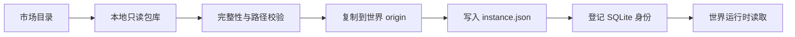

# 世界包实例

世界包实例把市场内容分成三个明确层次：市场目录负责发现，工作区包库保存经过验证的只读版本，世界实例决定某个世界实际运行哪个固定版本。

## 数据边界

每个实例同时拥有 SQLite 身份和世界本地文件：

```text
worlds/<worldId>/source/packages/<instanceId>/
├─ origin/
├─ overrides/
└─ instance.json
```

- `origin` 是从本地包库复制的已校验内容，创建后不可由市场升级修改。
- `overrides` 保存该世界未来的本地覆盖，不回写市场模板或包库。
- `instance.json` 记录包 ID、版本、类型和内容摘要。
- SQLite 表 `world_package_instances` 保存世界归属、活动状态和相对路径，不保存机器绝对路径。

世界目录属于 `stateRoot`，随现有 `worlds/` 一起进入完整本地备份。更新应用源码、依赖或 Harness 不会改写世界实例。

## 创建流程



创建过程先验证包库内容，再写入世界内的临时目录，最后原子改名并登记数据库。数据库登记失败时只清理本次新建的精确实例目录。相同版本和内容摘要的重复请求返回现有实例；不同版本不会隐式覆盖，更新必须先预览并显式停用旧实例。

## 运行时规则

- 会话 Prompt Transform 只加载当前世界的活动实例。
- 世界主题只有在用户为该世界执行绑定后才创建实例并进入运行时。
- 角色蓝图只有在当前世界存在对应实例时才可用于招募。
- 包库升级不会改变现有世界；不同世界可以同时固定在不同版本。
- 包库列表可以作为只读选择来源，但不能直接参与聊天、主题资源读取或角色实例化。

## 安全与兼容

实例化拒绝绝对路径、目录穿越、符号链接和未声明文件。运行时继续使用包 manifest 的逐文件 SHA-256 校验与严格入口解析。数据库迁移只新增表和索引，不修改已有包、世界、会话或角色数据。

当前版本提供实例化、读取、停用和显式主题绑定。带差异预览的版本 rebase、三方合并和 overrides 编辑器属于后续更新流程。
