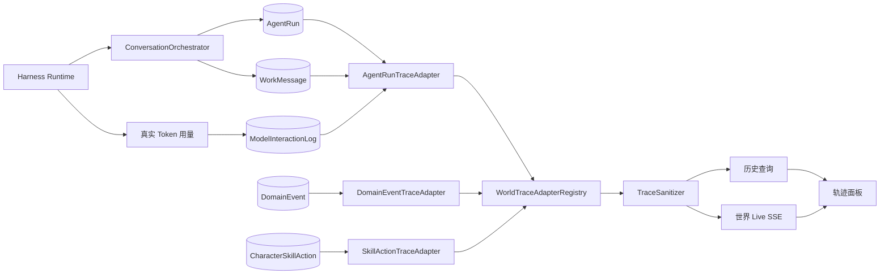

# 世界轨迹中心

## 当前能力

世界轨迹中心是每个世界的执行观测入口。聊天只展示用户消息、最终回复、附件和明确的产品通知；轨迹展示角色如何形成可公开的判断摘要、调度了哪些工具、执行是否成功、耗时多少，以及模型实际返回的 Token 用量。

轨迹不保存第二套业务事实。页面内容由 SQLite 中的 `AgentRun`、`WorkMessage`、`ModelInteractionLog`、`DomainEvent` 和 `CharacterSkillAction` 投影得到，刷新和重启后都能从权威数据恢复。

## 角色运行轨迹

每次 `AgentRun` 对应一条主轨迹。一次运行内的开始、判断摘要、工具调用、工具结果和结束状态会合并到同一个稳定 ID，不再为每个生命周期事件生成独立卡片。

主轨迹可以包含：

- 角色、会话和工作回合归属；
- 可公开的中文判断摘要；
- 结构化工具步骤及成功、失败、执行中状态；
- 整轮耗时、模型 ID 和模型服务；
- Harness 实际返回的输入、输出和合计 Token；
- 失败时可理解的中文说明。

普通用户消息、最终回复、角色日记、成长里程碑、关系变化、设置更新和重复的任务生命周期不会作为独立轨迹出现。它们分别属于聊天、角色档案或系统设置。

## 数据流



实时运行和持久化历史使用相同的 `AgentRun` 稳定 ID。实时事件先聚合成运行卡片，持久化完成后由权威投影接管，不会产生重复条目。

## 查询

```http
GET /api/worlds/:worldId/trace
  ?after=<opaque-cursor>
  &limit=1..200
  &category=<category>
  &status=<status>
  &actorId=<employee-id>
  &date=YYYY-MM-DD
  &search=<keyword>
```

结果按最新时间倒序返回。日期按运行应用的本地日历解释，关键词可匹配轨迹摘要、判断摘要、角色名、工具名称、模型和服务。游标用于继续读取更早的轨迹。

前端默认读取最新 50 条，支持加载更早记录。筛选在服务端执行，实时条目也使用相同条件。面板按角色汇总当前结果中的实际 Token，用量缺失时明确显示模型尚未返回，而不是进行估算。

## 安全边界

所有历史和实时条目都经过 `TraceSanitizer`。轨迹禁止展示：

- 隐藏思维链；
- 完整 Prompt 和用户未要求公开的内部指令；
- 原始工具参数、原始工具结果和文件内容；
- API key、Authorization、Cookie、密码、Token 和其他凭据；
- 未经验证的模型自然语言声明。

判断摘要必须是提供方明确输出的可公开摘要。增量推理片段不会进入历史和界面。工具只展示可理解的调度名称与结果状态。

## 验证范围

自动化验证覆盖：

- 一个角色运行只生成一个稳定轨迹 ID；
- 多次运行不会因复用 Harness Session 而合并；
- 判断摘要与工具步骤从持久化事实恢复；
- 实时、刷新和重启使用同一轨迹身份；
- 角色、日期、关键词、状态、内容类型和游标分页；
- 实际 Token 与 `AgentRun`、角色和世界正确关联；
- Prompt、凭据、原始工具输入和结果不会泄露；
- 聊天界面不展示推理与工具明细。
