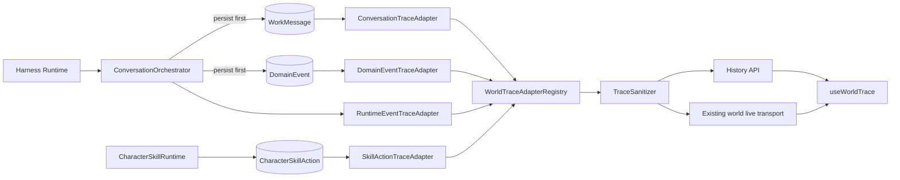

# World Trace Center V1

## Status

World Trace Center V1 is the execution-observability boundary for a world. It separates conversational results from operational evidence without introducing a second source of truth.

The product rule is:

> Chat surfaces final conversational results. Execution details belong to Trace.

## Information architecture

The workbench has three distinct concerns:

```text
Left                Center                Right Dock
Conversations       Chat                  World
                                           Trace
                                           Dossier
```

Chat contains user messages, final assistant messages, attachments and explicit product notices. It does not render reasoning summaries, token deltas, tool calls, tool results or live turn diagnostics.

Trace contains meaningful execution facts. It does not contain render ticks, heartbeat messages, snapshot refreshes, polling records or coordinate-by-coordinate movement.

## Contract

`WorldTraceEntry` is provider-, renderer- and UI-neutral. Its stable fields are:

```text
id
worldId
category: agent | tool | skill | task | collaboration | world | schedule | system
status: pending | running | waiting | success | failed | cancelled | info
summary / optional safe detail
optional actor/session/task/skill/schedule/run references
sourceKind / sourceId / optional sourceSequence
createdAt / updatedAt
```

The `schedule` category and `scheduleId` / `runId` references are reserved now so a future scheduler can register an adapter without changing the core trace contract.

## Read-model flow



The Orchestrator persists the corresponding WorkMessage or DomainEvent before notifying subscribers. Therefore a live trace notification never becomes the canonical fact. Refresh and restart recovery always rebuild from durable sources.

## Adapter registry

Core Trace knows how to register adapters, normalize entries, sanitize, merge by stable ID, sort, filter and paginate. It does not contain provider-specific branches.

V1 registers:

- `DomainEventTraceAdapter` for semantic domain lifecycle and world events;
- `RuntimeEventTraceAdapter` for current Harness runtime events;
- `SkillActionTraceAdapter` for durable Skill actions;
- `ConversationTraceAdapter` for message-backed user requests, provider reasoning summaries and final responses;
- `ScheduleTraceAdapter` as a provider-neutral future scheduler boundary.

Future GitHub, browser, Feishu or scheduler sources must enter through a new adapter. They must not add `if (provider === ...)` branches to `WorldTraceService`.

## Stable identity and lifecycle updates

Started/completed pairs use one logical trace ID:

- every orchestrated turn receives a random `traceTurnId`; turn start/completion/failure use that ID;
- a tool action is keyed by `traceTurnId` and call ID;
- a task is keyed by the same `traceTurnId` as its runtime turn;
- every submitted collaboration receives a `meetingRunId`; meeting start/finish use that ID;
- a Skill action is keyed by its durable action ID.

The later fact replaces the visual status while preserving the original `createdAt`. Reusing a Harness agent session across multiple user turns does not collapse their history because `traceTurnId` is unique per orchestration. Live and historical adapters derive the same IDs from persisted runtime metadata, so reconnect recovery updates rather than duplicates entries. At the end of each conversation request, new durable conversation, domain and Skill projections are flushed to the existing world stream so `task.completed`, `task.blocked` and `meeting.finished` never wait for a manual refresh.

## History API and recovery

```http
GET /api/worlds/:worldId/trace
  ?after=<opaque-trace-cursor>
  &limit=1..200
  &category=<category>
  &status=<status>
  &actorId=<actor-id>
```

Response:

```json
{
  "items": [],
  "nextCursor": "optional opaque cursor"
}
```

The trace cursor is independent from World Runtime snapshot sequence and SSE `Last-Event-ID`. The UI re-reads history whenever the existing `/api/worlds/:worldId/live` transport reconnects, then merges by stable ID. No third SSE endpoint is introduced.

## Security boundary

All entries pass through `TraceSanitizer`, including entries emitted live. Adapters expose semantic summaries instead of raw payloads.

Never expose:

- API keys, authorization headers, cookies, passwords, tokens or credentials;
- full user/runtime prompts;
- raw tool inputs or raw tool results;
- file contents or arbitrary provider metadata;
- hidden chain-of-thought.

`assistant.reasoning` is projected only when the provider emitted an actual summary. Token-level `reasoning.delta` and `text.delta` events are excluded from Trace history and UI.

## UI behavior

Trace UI lives under `components/world-trace/` and is not embedded in `App.tsx` or `ArtifactDock` logic. The panel provides category, status and actor filters, stable lifecycle updates, safe details and a refresh action.

The timeline auto-scrolls only while the user is already near the bottom. Otherwise it preserves reading position and shows a new-entry indicator. Large timelines use `content-visibility` to avoid rendering every off-screen card eagerly.

## Verification

V1 tests cover:

- registry and future scheduler fixture;
- normalizing and lifecycle deduplication;
- centralized credential sanitization;
- stable live/history identity;
- stable updates within one turn and distinct identities across repeated turns;
- category/status/actor filtering and cursor pagination;
- live reconnect and restart recovery;
- Chat final-result projection;
- exact `世界 | 轨迹 | 档案` Dock structure;
- live visual-entry update instead of duplicate append.
