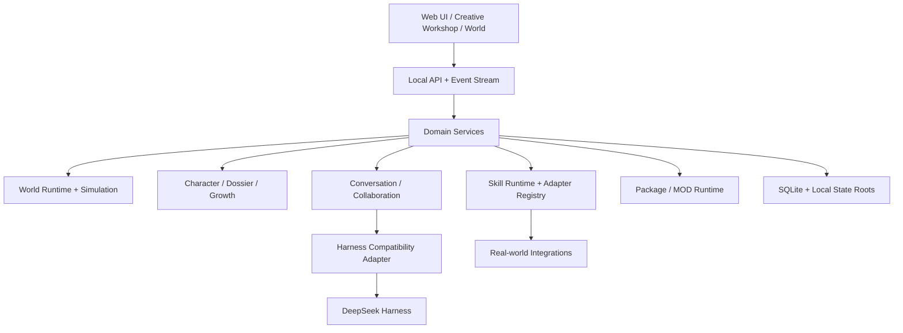

# DSH Cyber Technical Report

> Status: Pre-Alpha / Core Reliability & Work System V1 implemented; local-data compatibility baseline remains a candidate

## Abstract

DSH Cyber explores a local-first embodied AI world: persistent AI characters live inside visual worlds, maintain independent identity and history, collaborate with other characters, and can acquire trusted Skills that cross the boundary from a simulated world into real systems.

The project deliberately avoids reducing an AI character to a prompt. A character is treated as a long-lived domain entity with identity, Agent session, model policy, memory ownership, embodiment, relationships, Skill grants, work history and growth evidence.

The long-term goal is a platform where users can create worlds and characters visually, install Themes / Plugins / Character Blueprints / Skill Packs as MOD-like extensions, and connect selected characters to real-world systems such as GitHub, browsers, IM channels, Home Assistant and other trusted adapters.

This report describes the current implementation, architecture boundaries, lessons adopted from DeepSeek Harness and OpenAI Codex, and the roadmap from the current Pre-Alpha to a stable extensible platform.

---

## 1. Product thesis

A durable AI character should be modeled as:

```text
Character
├─ Identity
├─ Persona
├─ Agent Session
├─ Model Policy
├─ Embodiment
├─ Memory
├─ Relationships
├─ Skill Grants
├─ Work History
├─ Evidence
└─ Growth
```

The visible world is not decorative. It is a projection of real domain state: tasks, conversations, collaboration, ambient routines, world events, role semantics and persistent character state.

Likewise, a Skill is not a sentence in a prompt. A Skill is an authorized capability with structured actions, provider-specific execution behind a trusted adapter, durable status and audit evidence.

---

## 2. Current system

### Implemented

The current branch already includes:

- independent local workspaces and worlds;
- persistent world / employee / session storage;
- DeepSeek Harness adapter and runtime candidate validation;
- real independent Agent sessions;
- direct and group conversations;
- bounded character-to-character collaboration;
- shared world episodes and relationship evidence;
- deterministic role-aware ambient life;
- role-agnostic character animation rig;
- explicit semantic `EmbodimentProfile` for custom roles;
- World Runtime / Simulation separation;
- character dossiers and evidence-based milestones;
- unified local extension market for themes, plugins and character blueprints;
- local Creative Workshop project library;
- declarative Workshop world/character generation;
- generated character packages validated through `PackageManager`;
- `requestedSkills` separated from actual `skillGrants`;
- trusted Skill Adapter registry foundation;
- first Home Assistant Skill Adapter;
- durable Skill actions and scheduling;
- canonical direct conversation per character;
- pinned/hidden conversation preferences;
- full local `.dshbackup` including Workshop and Skill state;
- controlled Harness update / rollback flow.
- Task / Plan Revision / Assignment / TaskRun / immutable Deliverable / Review domain model;
- SQLite queue claim/lease recovery and derived Employee Presence/Health;
- durable Completion Outbox that separates the final answer from Artifact post-processing;
- atomic serialized credential file fallback behind a SecretStoragePort;
- World Trace Center with adapter-based projections over durable domain, conversation and Skill facts;
- chat/result and execution/trace separation with reconnect recovery and centralized sanitization.

### Intentionally incomplete

The following areas are still platform work rather than finished product features:

- general-purpose Skill Adapter ecosystem;
- persistent memory architecture beyond current dossier/history evidence;
- autonomous operating loop and autonomous delegation policy;
- bounded autonomous delegation beyond the explicit Work System V1 flow;
- Feishu / QQ / WeChat channel adapters;
- remote extension registry and cryptographic signatures;
- stable project editing/versioning inside Creative Workshop;
- rich custom avatars / bodies / 2D and future 3D MOD pipeline;
- optional encrypted cloud sync;
- public release packaging and compatibility guarantees.

---

## 3. Domain architecture



The important rule is that no single layer owns the whole product.

```text
World != Character != Skill != Harness
```

They compose through explicit contracts.

---

## 4. Character identity and embodiment

### Stable identity

A stable `characterId` connects:

```text
Agent identity
canonical direct conversation
world body
dossier
memory owner
growth owner
skill grant owner
relationship participant
```

Display names are mutable presentation. They are never used as primary identity.

### User-defined identity wins

A character may start from a template, but user customization becomes the active character truth.

For example, if a user starts with a generic assistant blueprint and later defines:

```text
name: 团子
form: cat
relationship: companion
persona: proud, sensitive, affectionate
```

the runtime must not continue to infer “secretary” behavior from the original template name.

Runtime context should be assembled from the current character state:

```text
Current Identity
+ Current Persona
+ Relationship
+ Embodiment
+ Memory
+ Current Skill Grants
+ World Context
```

Templates are construction material, not permanent hidden identity.

### Semantic embodiment

`EmbodimentProfile` stores portable semantics rather than coordinates:

```text
role tags
preferred zone tags
facility capabilities
allowed zones
home slot tags
ambient behaviors
actor rig
social policy
```

A theme maps those semantics into its own scene. This allows the same character to inhabit an office, tavern, home, studio or future 3D world without rewriting Agent logic.

---

## 5. Creative Workshop as a compiler

Creative Workshop is designed as a local project system, not a one-shot form.

```text
Project Source
   ↓ normalize / validate
Portable World + Character Contracts
   ↓ compile
Generated MOD Packages
   ↓ PackageManager.preview
Verified Package Set
   ↓ install
World + Character Runtime Entities
```

The local project source is valuable user data. Generated files are rebuildable.

Current project storage lives under `stateRoot/workshop` and is independent from the Git checkout.

### Why package generation matters

Without this boundary, Workshop would become a second private path that directly writes characters and bypasses extension validation. By compiling into the same package contracts used by the extension ecosystem, built-in creation and user MOD creation converge on one runtime path.

### Editing strategy

During V1, existing projects can safely be duplicated as a new project. Direct mutation of a running project's immutable blueprint history is postponed until project versions, upgrade plans and migrations are defined.

---

## 6. Skill Runtime and the real world

### Capability states are different

```text
Available Skill
≠ Requested Skill
≠ Granted Skill
≠ Approved Action
≠ Executed Action
```

This distinction is central to the safety and extensibility model.

### Adapter architecture

```text
CharacterSkillRuntime
├─ grant validation
├─ action proposal routing
├─ scheduling
├─ durable action state
├─ audit
└─ factual result injection
        │
        ▼
CharacterSkillAdapterRegistry
├─ HomeAssistantAdapter
├─ future GitHubAdapter
├─ future BrowserAdapter
├─ future FeishuAdapter
├─ future MQTTAdapter
└─ ...
```

Provider-specific code must not be added as `if (skillId === ...)` branches inside the runtime.

### Honest execution

An action has explicit state such as:

```text
scheduled
executed
waiting-for-integration
failed
```

The Agent may only state that an external action completed when the trusted adapter reports an execution result. World animation and natural-language intention are not execution evidence.

---

## 7. What we adopt from DeepSeek Harness

DSH Cyber does not copy Harness internals into the domain model. It adopts architectural ideas where they fit.

DeepSeek Harness separates Agent registry, factory/loop implementation, scoped setup and publication. An Agent is composed before publication; setup failure can roll back before observers see a partially configured Agent.

DSH Cyber applies the same style of thinking to platform capabilities:

- use registries rather than global hard-coded switch statements;
- compose capabilities at stable boundaries;
- keep setup and execution separate;
- publish runtime entities only after validation succeeds;
- keep lifecycle ownership explicit;
- use scoped capability resolution where appropriate;
- keep Harness behind an adapter instead of leaking its private API upward.

The DSH Cyber domain adds its own requirements: local ownership, visual worlds, persistent characters, user-created MODs, relationship evidence, Skill grants and upgrade safety.

Reference implementation studied: `deepseek-ai/deepseek-harness`.

---

## 8. What we adopt from OpenAI Codex

Codex models risky operations as concrete reviewable actions: commands, patch application, network access, MCP tool calls and permission requests can carry contextual risk and authorization information. It also distinguishes one-time approval, session approval and policy amendments rather than treating a plugin as globally trusted after installation.

DSH Cyber maps these ideas to the Skill layer:

```text
Action
├─ skillId
├─ adapterId
├─ target
├─ structured parameters
├─ risk
├─ authorization source
└─ execution status
```

Future reusable approvals should be scoped to concrete Skill / Action / Target / Scope rules. The system should avoid granting generic shell, filesystem or network access when a narrow trusted adapter is sufficient.

Reference implementation studied: `openai/codex`.

---

## 9. Persistence and local-first ownership

Current authority is local `stateRoot`.

```text
<stateRoot>/
├─ data/
├─ worlds/
├─ assets/
├─ packages/
├─ workshop/
├─ skills/
├─ credentials/
├─ runtime/
└─ backups/
```

Program files and user state have separate lifecycles.

```text
Git checkout / dependencies / dist
             │ update program
             ▼
          runtime
             │ read/migrate
             ▼
          stateRoot
```

Normal program updates must not wipe user state.

### Pre-Alpha restructuring boundary

The project is still early and currently has no meaningful external installed-user compatibility burden. Until Creative Platform V1 is declared a compatibility baseline, we prefer clean architecture over permanent migration code for every experimental development snapshot.

If an early development format blocks the correct model, it can be deliberately replaced with a documented development reset rather than accumulating years of compatibility debt for data that never shipped.

### After the compatibility baseline

Once a release is declared compatible for real users:

- every persisted schema gets a version;
- migrations are forward and tested;
- migration failure stops new writes;
- backups are taken before risky upgrades;
- new persistent roots are added to `.dshbackup`;
- normal updates never instruct users to delete `stateRoot`;
- backup/restore becomes a release gate.

---

## 10. Memory and growth roadmap

A scalable memory system should distinguish:

```text
Episodic      what happened
Semantic      what facts were learned
Procedural    what procedure works
Relationship  what changed between characters
```

Memory records should have source, scope, timestamp and evidence. Chat history alone is not sufficient long-term memory.

Growth is evidence-driven:

```text
Task / Review / Deliverable / Skill Action / Shared Episode
                    ↓
                 Evidence
                    ↓
           Skill proficiency / milestone
```

A model saying “I learned this” cannot directly increase a durable skill level.

---

## 11. Autonomous company loop

A later milestone is a bounded operating loop:

```text
Task ingress
→ assign character
→ retrieve memory
→ plan
→ use real Skills/Tools
→ delegate when policy allows
→ aggregate deliverables
→ review
→ deliver
→ write evidence
→ update memory/growth
→ reflect state in world
```

Autonomy must have budgets and boundaries such as maximum delegation depth, rounds, token budget, cooldowns, approval requirements and external side-effect policies.

---

## 12. Extension / MOD direction

The long-term extension model should support:

- World Theme;
- Character Blueprint;
- Asset Pack;
- declarative Plugin;
- trusted Skill Adapter;
- workflow/automation definitions;
- future animation/body rigs;
- future 3D world assets.

Community packages must remain data and contracts by default. Arbitrary code execution is a different trust tier and should not be introduced casually.

---

## 13. UI architecture

Current product information architecture:

```text
Topbar
├─ Creative Workshop
├─ Market
├─ Runtime health
└─ Settings

Left
└─ Conversations only

Center
└─ Chat / workbench

Right
├─ World
├─ Trace
└─ Dossier
```

Market owns template/extension installation. Dossier owns concrete character creation, configuration and authorization. This prevents the same concept from being represented by multiple conflicting entry points.

Chat presents final conversational results only. Provider reasoning summaries, tool lifecycle, task lifecycle, Skill actions, collaboration and semantic world events belong to Trace. Trace is rebuilt from canonical `DomainEvent`, `WorkMessage` and `CharacterSkillAction` facts instead of maintaining a second event database. Its live view reuses the existing world live transport and recovers through an independent cursor-based history API.

---

## 14. Engineering strategy

Current CI is intentionally staged for Pre-Alpha:

```text
Required PR CI
= typecheck + unit/integration

Full E2E
= main + nightly + manual
```

As the product stabilizes, Smoke E2E and later full migration/release matrices will become required.

The guiding engineering rule is simple:

> Prefer a reusable contract and one correct runtime path over a new hard-coded branch that only solves the current demo.

---

## 15. Next milestones

### P0 — Creative Platform V1 stabilization

- finish Workshop project lifecycle;
- finalize world / character / Skill contracts;
- remove remaining role-name inference from new paths;
- establish local-data compatibility baseline;
- add smoke E2E for core flows.

### P1 — Real work system

- Task / Job / Run / Assignment / Deliverable / Review;
- artifact and evidence ownership;
- character current-work UI.

### P1 — Memory & Growth V2

- episodic / semantic / procedural / relationship memory;
- retrieval and consolidation;
- evidence-based progression.

### P1 — Skill ecosystem

- generic host registry and scoped resolution;
- GitHub Adapter;
- Browser Adapter;
- Feishu Adapter;
- approval policy UI and audit timeline.

### P2 — MOD ecosystem

- remote registry;
- signatures;
- dependencies;
- version compatibility;
- update / uninstall / rollback;
- authoring CLI.

### P2 — Optional cloud sync

- encrypted sync of versioned user-domain data;
- local remains authoritative;
- offline operation remains supported.

---

## References

- DeepSeek Harness: https://github.com/deepseek-ai/deepseek-harness
- OpenAI Codex: https://github.com/openai/codex
- DSH Cyber website: https://www.sandaoliu.cn/
- Creative Platform V1 architecture: [`architecture/creative-world-platform-v1.md`](./architecture/creative-world-platform-v1.md)
- Architecture guidelines: [`development/architecture-guidelines.md`](./development/architecture-guidelines.md)
- CI strategy: [`development/ci-strategy.md`](./development/ci-strategy.md)
- Local upgrade safety: [`operations/local-first-upgrades.md`](./operations/local-first-upgrades.md)
- World Trace Center V1: [`architecture/world-trace-center-v1.md`](./architecture/world-trace-center-v1.md)

# 2026-08-28 Creative Workshop V2 技术更新

- 新增 `CreativeWorkshopDraftV1`、严格草稿校验、工作区草稿持久化和默认模型 AI 草稿生成器。
- AI 返回内容在任何实体写入前完成 Schema、越权字段、角色数量和模型引用验证。
- 新增统一两层 `ModelPicker`，世界和角色保存 ModelProfile 引用；对话支持临时回合覆盖。
- 模型发现增加 DNS/SSRF、凭据转发与重定向防护。
- 对话 Prompt 增加 Unicode 规范化、控制字符和长度边界；历史上下文使用结构化编码。
- 修复单条消息“另有 1 条排队”、Stop SSE 反馈、语言状态分裂和世界皮肤场景不同步。
- 自定义皮肤素材改为本机上传卡片，统一全景图同时驱动聊天和 2.5D 世界。
